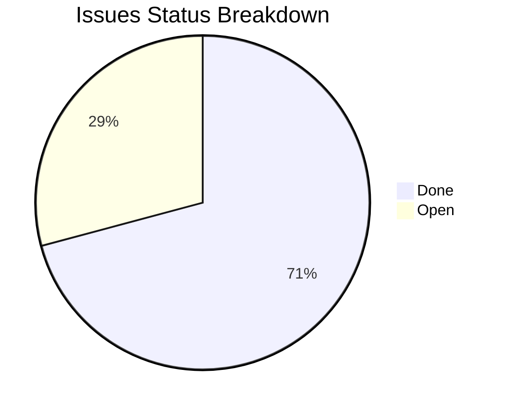

# Along Executive Dashboard & Repository Analytics

> Auto-generated on `2026-08-27 22:33:59` for repository `along`.

## 1. Executive Summary

| Metric | Value | Details |
| :--- | :--- | :--- |
| **Completion Progress** | `70.8%` | `17` done / `24` total |
| **Active Backlog** | `7` open, `0` in-progress | `0` blocked |
| **Active Risks** | `0` active | `0` critical/high |
| **Milestones Tracked** | `5` | Stage releases |
| **Session Logs / ADRs** | `14` sessions / `11` ADRs | Architectural record |
| **Knowledge Base** | `4` articles | `.along/KB/` documentation |
| **Context Footprint** | `13` lines | `.along/CONTEXT.md` |

## 2. Issues Breakdown

## 3. Active Issues & Backlog

| Status | Type | Priority | Issue | Milestone / Blockers |
| :--- | :--- | :--- | :--- | :--- |
| `open` | `feat` | `high` | [Introduce Agentic Goals (Autonomous Loop) & Mandatory Checklists](./ISSUES/done/feat--agentic-goals-and-mandatory-checklists.md) | v1.5.0-dashboard-and-analytics |
| `open` | `feat` | `medium` | [Automated UI Screenshots & Visual Verification Attached to Issues](./ISSUES/feat--automated-ui-screenshots-and-visual-verification.md) | v2.0.0-along-transition |
| `open` | `feat` | `medium` | [External Issue Trackers Integration & Bi-Directional Importer (Jira, Redmine, Linear, GitHub, GitLab)](./ISSUES/feat--external-issue-trackers-sync-and-import.md) | v2.0.0-along-transition |
| `open` | `feat` | `high` | [Knowledge Base Management Standards & `/along-init-kb` Skill](./ISSUES/feat--knowledge-base-management-and-init-kb-skill.md) | v1.5.0-dashboard-and-analytics |
| `open` | `feat` | `medium` | [Lsif Scip Lsp Mcp Integration](./ISSUES/feat--lsif-scip-lsp-mcp-integration.md) | v1.5.0-dashboard-and-analytics |
| `open` | `feat` | `medium` | [Support & Integration for OpenClaw / OpenClaude and Hermes Agent Providers](./ISSUES/feat--openclaw-and-hermes-agent-integration.md) | v2.0.0-along-transition |
| `open` | `feat` | `high` | [Token Efficiency & Context Window Optimization System](./ISSUES/feat--token-efficiency-and-context-optimization-skills.md) | v1.5.0-dashboard-and-analytics |

## 5. Milestones & Sprints

| Milestone | Status | Due Date | Progress |
| :--- | :--- | :--- | :--- |
| [v1.0.0: Initial Agent Protocol and Core Scaffolding](./MILESTONES/v1.0.0-initial-architecture.md) | `completed` | `2026-08-04` | `100%` |
| [v1.1.0: Antigravity Support and Issues Tracking Model](./MILESTONES/v1.1.0-antigravity-support-and-issues-model.md) | `completed` | `2026-08-13` | `100%` |
| [v1.3.0: Knowledge Base Architecture and Code Graph Integration](./MILESTONES/v1.3.0-knowledge-base-and-graph.md) | `completed` | `2026-08-26` | `100%` |
| [v1.5.0: Automated Entity Ecosystem & Project Dashboard](./MILESTONES/v1.5.0-dashboard-and-analytics.md) | `in-progress` | `2026-09-05` | `60%` |
| [v2.0.0: Transition to Along Ecosystem & Universal Tooling](./MILESTONES/v2.0.0-along-transition.md) | `completed` | `2026-08-27` | `100%` |

