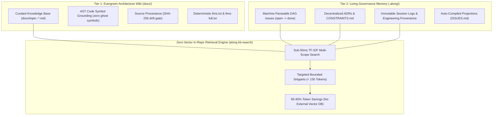

# ActDim Along (v4.1.0)

**The Provider-Agnostic Context & Memory Operating System for AI Coding Agents.**

One universal convention (`ALONG-PROTOCOL v4.1.0`) and automation skills suite honored natively across **Claude Code**, **Google Antigravity**, **OpenAI Codex**, and **OpenCode**.

ActDim Along eliminates **agent context amnesia**, prevents **architectural drift**, and stops **token bloat** by transforming any codebase into an AI-ready engineering workspace with durable in-repo memory, token-efficient LLM-Wiki intelligence, and autonomous multi-agent coordination.

---

## Why Along?

AI coding agents are exceptionally capable, but they start every session blind:
- **Context Amnesia**: Agents forget past architectural choices, re-invent rejected patterns, and drop active tasks across sessions.
- **Token Combustion**: Dumping monolithic context files or full directories into prompts wastes tens of thousands of tokens per turn.
- **Multi-Branch Chaos**: Parallel agents clobber shared docs, status boards, and lock files, causing painful git merge conflicts.
- **Unanchored Edits & Hallucinations**: Without strict guardrails, agents make rogue modifications, bypass test gates, and produce silent regressions.
- **Stack Friction & Tool Blindness**: Agents stumble across differing build tools, test frameworks, and release workflows. They execute noisy commands that flood context buffers with megabytes of logs, or hallucinate project-specific build invocations.
- **Workspace Pollution & Contamination**: Parallel or autonomous agents executing directly in developer working directories corrupt uncommitted work-in-progress, disrupt IDE language servers, or fail abruptly on bare worktrees lacking dependencies.
- **Soft Prompt Decay & Hallucinated Compliance**: Natural language instructions in markdown rules or system prompts decay as context grows, lacking hard mechanical execution guardrails.

**Along fixes this by embedding a Dual-Tier Memory Architecture into your repository: an Andrej Karpathy-style LLM-Wiki (`docs/`) for evergreen architectural consensus, and a machine-parseable living memory layer (`.along/`) for transactional project governance.** Agents read past decisions, track issues in a DAG, plan autonomously, search across all project memory in milliseconds via zero-vector unified retrieval, and verify their own work before committing.

---

## Core Value Proposition

| Pillar | How Along Delivers It |
| :--- | :--- |
| **Zero-Vector In-Repo Intelligence** | Sub-50ms TF-IDF multi-scope retrieval engine (`along-kb-search`) unifying docs, ADR constraints, active issues, and session logs into word-boundary aligned snippets (< 150 tokens), cutting token exploration costs by 85-95% without external vector DBs or daemon processes. |
| **Dual-Tier Memory Architecture** | Clean architectural separation: Evergreen LLM-Wiki (`docs/`) with AST code symbol grounding and SHA-256 drift detection vs. Living Transactional Governance (`.along/`) with DAG issues, immutable session history, and atomic projections. |
| **Persistent In-Repo Memory** | Durable, git-tracked memory (`.along/`): DAG issues, append-only ADR logs, milestones, risks, and session records that travel with the codebase. |
| **Autonomous Multi-Agent Teams** | Sequential living-plan state machine (`along-team`): Supervisor -> Scout -> Architect -> Implementer -> Reviewer with session blackboards, hard retry limits, and single-agent degradation. |
| **Runtime Worktree Workspace Isolation** | Ephemeral Git worktree isolation (`along worktree`, `/along-team --worktree`) satisfying the 3-part Environment Readiness Contract: NTFS junctions / symlinks for dependencies (`node_modules`, `.venv`), `.env` configuration copying, real-time session blackboard sharing, and Windows file lock resilient teardown. |
| **Runtime Mechanical Prose Enforcement** | Active agent lifecycle interception (`PreToolUse`, `Stop`) turning markdown guidelines into hard runtime errors across Claude Code, Antigravity, and Codex, with machine-checked bi-directional traceability (`along hook verify`). |
| **Token-Efficient LLM-Wiki (`docs/`)** | Modular knowledge base with in-place source provenance, SHA-256 drift detection, deterministic `llms.txt` compilation, and targeted snippet search (`along-kb-search`) avoiding full-file context ingestion. |
| **Stack-Agnostic Lifecycle & Polyglot Hooks** | Unified agent execution contract (`/along-build`, `/along-test`, `/along-dev`, `/along-version-bump`, `/along-dep-scan`) with zero-config stack auto-detection and polyglot repository hooks (`.along/scripts/` in Python, Bash, PowerShell, Batch). |
| **Zero-Conflict Git Concurrency** | Single Source of Truth (SSOT) atomic files vs compiled projections (`ISSUES.md`, `INDEX.md`), union merges (`merge=union`), and decentralized date-slug ADRs that never collide in parallel branches. |
| **Engineering Provenance & Dual-Track UI** | Living plans, fix loops, and verification gates are permanently recorded in session logs while projecting interactive visual review cards in IDEs (Antigravity). |
| **Strict Data Safety & Verification Gates** | Hermetic engines (`alongkit`) with transactional byte-exact rollbacks, strict front-matter preservation (`ruamel.yaml`), and zero-unintended-deletions invariant. |
| **Declarative Runtime Gates & Traceability** | Mechanical agent lifecycle interception (`PreToolUse`, `Stop`) enforcing 12 protocol invariants, backed by machine-checked bi-directional traceability (`along hook verify`) between prose badges and YAML rules. |
| **Nearest Context Boundary** | Monorepos, microservices, and Git submodules maintain isolated localized memory, preventing root workspace pollution. |

---

### Dual-Tier Memory Architecture: Evergreen Wiki vs. Living Governance

Along divides repository intelligence into two specialized, complementary tiers to keep agent context scalable and predictable:



- **Tier 1: Evergreen Architecture Wiki (`docs/`)**:
  - **Purpose**: Curated, cumulative knowledge base representing the current factual state of system design.
  - **Mechanisms**: In-place source provenance (`sources: [{path, hash}]`), AST code symbol verification to prevent hallucinated interfaces, and deterministic compilation into `docs/INDEX.md` and `llms.txt`.
  - **Lifecycle**: Evolves with the codebase. Never transactional; updated only when public contracts, workflows, or architecture change.
- **Tier 2: Living Governance Memory (`.along/`)**:
  - **Purpose**: Transactional project memory, active task execution state, and historical audit trails.
  - **Mechanisms**: Machine-parseable DAG issues with lifecycle states, modular ADRs (`ADR-YYYY-MM-DD--<slug>.md`), compiled constraints projection (`CONSTRAINTS.md`), and append-only session history.
  - **Lifecycle**: Transactional and stateful. Closed issues and session logs are permanent and immutable.
- **Unified Retrieval Engine (`along kb-search`)**:
  - Unifies both tiers in a single fast local query without vector embeddings, cloud dependencies, or background daemon processes.
  - Returns word-boundary aligned snippets (< 150 tokens) directly to agent prompts, slashing exploration context costs by 85-95%.

---

## Using Along in Your Projects? (Drop-In Blurb)

Add this badge and blurb to the `README.md` of any repository powered by Along:

````markdown
### AI Development: Powered by [ActDim Along](https://github.com/actdim/along)

This repository follows the **ActDim Along Protocol** for AI agent context, persistent memory, and autonomous workflows:
- **Dual-Tier Memory**: Evergreen LLM-Wiki in `docs/` and living governance memory in `.along/` survive across all AI sessions.
- **Zero-Vector Unified Retrieval**: Fast local snippet search across architecture, decisions, and issues with 85-95% token reduction and zero external database dependencies.
- **Runtime Worktree Isolation**: Autonomous agent tasks execute in isolated Git worktrees with automatic dependency linking, preserving clean developer checkouts.
- **Mechanical Quality Gates**: Protocol rules, clean typography, and issue bindings are mechanically enforced at runtime before tools execute.
- **Standardized Lifecycle Contract**: Unified commands for build, test, dev, release, and dependency discovery via pluggable `.along/scripts/` hooks.
- **Provider-Agnostic**: Compatible out of the box with **Claude Code**, **Google Antigravity**, **OpenAI Codex**, and **OpenCode**.
````

---

## Quickstart & Installation

Install Along across all supported AI providers with a single command:

### Windows (PowerShell)
```powershell
powershell -NoProfile -ExecutionPolicy Bypass -Command "irm https://raw.githubusercontent.com/actdim/along/main/install.ps1 | iex"
```

### Linux / macOS (Bash)
```bash
curl -fsSL https://raw.githubusercontent.com/actdim/along/main/install.sh | bash
```

The one-liner installer automatically bootstraps the repository into `~/.cache/actdim-along/repo` (via shallow `git clone` or archive fallback) and configures skills across Claude Code, OpenAI Codex, Google Antigravity, and OpenCode.

#### Manual / Local Checkout Installation
If you prefer to clone the repository manually or are developing Along:
```powershell
git clone https://github.com/actdim/along.git
cd along
powershell -NoProfile -ExecutionPolicy Bypass -File install.ps1 -Target all # Windows
bash install.sh --target=all                                               # Linux / macOS
```

An install records what it wrote in `~/.along/install-manifest.json`: it never deletes a
directory it does not own, so rules you wrote yourself survive every re-install, and
`install.ps1 -Uninstall` / `./install.sh --uninstall` removes exactly that record and
nothing else. See [Setup, Installation & Workflows](./docs/topic--setup-and-workflow.md).

---

## Knowledge Base & Architecture Index

The repository's complete technical specification is maintained as a living LLM-Wiki in [`docs/`](./docs/INDEX.md):

| Topic | Description | Link |
| :--- | :--- | :--- |
| **System Architecture** | Provider flow, context boundaries, MCP servers, and bridge layers. | [System Architecture & Flow](./docs/topic--architecture.md) |
| **CLI Command Reference** | Unified console command dictionary, subcommands, flags, and exit codes. | [Along CLI Command Reference](./docs/topic--cli-reference.md) |
| **Domain Model & Entities** | Machine-parseable schemas for Issues, ADRs, Milestones, and Risks. | [Domain Model & Entity Ecosystem](./docs/topic--domain-model.md) |
| **Setup & Workflows** | Installation matrix, repository onboarding, and session lifecycle. | [Setup, Installation & Workflows](./docs/topic--setup-and-workflow.md) |
| **LLM-Wiki Architecture** | Andrej Karpathy paradigm, source isolation, and token efficiency. | [LLM-Wiki Architecture & Paradigm](./docs/topic--llm-wiki-architecture.md) |
| **Runtime Hooks & Gates** | Agent lifecycle interception harness across Antigravity, Claude, and Codex. | [Runtime Lifecycle Hooks & Mechanical Gates](./docs/topic--runtime-hooks-and-gates.md) |
| **Declarative Gates & Traceability** | Extensible YAML gate engine and bi-directional machine-checked matrix. | [Declarative Gate Engine & Traceability Matrix](./docs/topic--declarative-gates-and-traceability.md) |

## Automation Skills Reference (Grouped by Workflow Phase)

Along provides **21 singular automation skills** structured across 6 core lifecycle phases:

### 1. Bootstrap & Repository Protocol Management
| Skill / Command | Purpose |
| :--- | :--- |
| **`along-init`** (`/along-init`) | Scaffold/refresh `AGENTS.md` + `CLAUDE.md` + `.along/` in a folder. |
| **`along-update`** (`/along-update`) | One-liner update of repository context, protocol, and global skills from GitHub. |
| **`along-version-bump`** (`/along-version-bump`) | Multi-stack version bump and release orchestrator (Node, Python, Rust, .NET). |

### 2. Orchestration, Planning & Multi-Agent Teams
| Skill / Command | Purpose |
| :--- | :--- |
| **`along-team`** (`/along-team`) | Sequential multi-agent autonomous development engine and living plan. |
| **`along start`** | Atomically claim issue, initialize session blackboard, and provision worktree. |
| **`along issue`** | Create, update (fuzzy milestones, priority), show, and close issues. |
| **`along milestone`** | Synchronize bidirectional target issues, calculate progress %, and show status. |
| **`along-issue-sync`** (`/along-issue-sync`) | Reconcile active issue board projection (`ISSUES.md`) with atomic issue files. |
| **`along-decision-sync`** (`/along-decision-sync`) | Record ADRs into append-only `.along/DECISIONS.md` and compile active `.along/CONSTRAINTS.md`. |

### 3. Development & Lifecycle Execution Runners
| Skill / Command | Purpose |
| :--- | :--- |
| **`along-build`** (`/along-build`) | Project build lifecycle hook via `.along/scripts/build.py` or auto-detected runner. |
| **`along-test`** (`/along-test`) | Automated test suite with quiet flags via `.along/scripts/test.py` or runner. |
| **`along-dev`** (`/along-dev`) | Local development/debugging server via `.along/scripts/dev.py` or runner. |

### 4. Quality Gates, Code Graph & Commit Integrity
| Skill / Command | Purpose |
| :--- | :--- |
| **`along-commit`** (`/along-commit`) | Smart ASCII-clean Conventional Committer linked to active `.along/` issue. |
| **`along hook verify`** (`along hook`) | Verify bi-directional traceability between prose badges and YAML gates. |
| **`along-graph-check`** (`/along-graph-check`) | Preflight health check and verification for `code-review-graph` MCP server. |
| **`along-graph-sync`** (`/along-graph-sync`) | Build or incrementally update `code-review-graph` AST code intelligence database. |
| **`along-graph-impact`** (`/along-graph-impact`) | Determine blast radius, affected flows, and candidate tests for changed symbols or files. |
| **`along-graph-arch`** (`/along-graph-arch`) | Architectural overview, community structure, coupling hotspots, and bridge nodes. |
| **`along-dep-scan`** (`/along-dep-scan`) | Scan declared dependencies for AI instructions into `docs/topic--dependencies.md`. |
| **`along context-budget`** (`along budget`) | Context budget measurement and regression gate (`--check`, `--json`). |

### 5. Knowledge Base & LLM-Wiki Intelligence
| Skill / Command | Purpose |
| :--- | :--- |
| **`along-kb-sync`** (`/along-kb-sync`) | Idempotent LLM-Wiki Knowledge Base compiler, AST symbol grounding, and link integrity gate in `docs/`. |
| **`along-kb-search`** (`/along-kb-search`) | Zero-vector, sub-50ms multi-scope snippet search across `docs/`, ADRs, issues, and session logs (< 150 tokens/match). |

### 6. Visual Analytics, History & Diagnostics
| Skill / Command | Purpose |
| :--- | :--- |
| **`along-dash`** (`/along-dash`) | Launch executive dashboard (Web UI, CLI, Cytoscape DAG, HTML export). |
| **`along-history-sync`** (`/along-history-sync`) | Reconstruct `.along/` milestones, issues, and sessions from Git commits. |
| **`along-feedback`** (`/along-feedback`) | System self-diagnostics, incident logging, and feedback dispatch. |
| **`along-wrap`** (`/along-wrap`) | Unified end-of-stage wrap: verification checklist, session log, issues, history. |

---

## License

MIT License. See [LICENSE](./LICENSE) for details.
