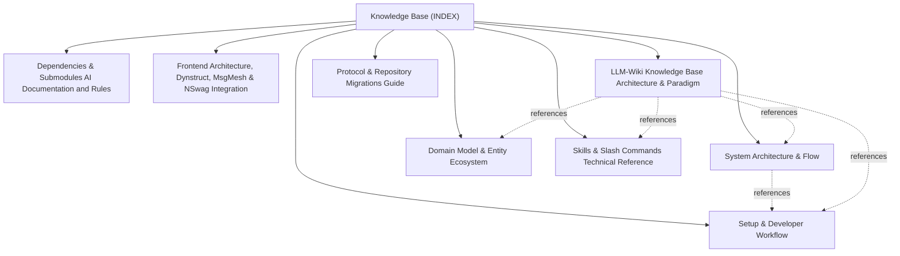

# Knowledge Base Topic Index

Central entry point and cross-linked topic catalog for project documentation:

## Knowledge Graph & Topic Map

---

## Articles

- **[System Architecture & Flow](./topic--architecture.md)** (architecture) `architecture`, `boundaries`, `multi-agent`, `blackboard`, `concurrency`, `mcp`, `flow`
- **[Dependencies & Submodules AI Documentation and Rules](./topic--dependencies.md)** (topic) `dependencies`, `ai-context`, `submodules`, `vendor`, `rules`
- **[Domain Model & Entity Ecosystem](./topic--domain-model.md)** (domain-model) `domain-model`, `entities`, `schemas`, `dag`, `metadata`, `issues`, `milestones`, `risks`, `spikes`, `checklists`, `sessions`
- **[Frontend Architecture, Dynstruct, MsgMesh & NSwag Integration](./topic--frontend-frameworks.md)** (topic) `dynstruct`, `dynstruct-mui`, `msgmesh`, `utico`, `react`, `mui`, `nswag`, `openapi`, `architecture`
- **[LLM-Wiki Knowledge Base Architecture & Paradigm](./topic--llm-wiki-architecture.md)** (topic) `llm-wiki`, `architecture`, `knowledge-base`, `token-efficiency`, `indexing`, `methodology`, `search`, `karpathy`
- **[Protocol & Repository Migrations Guide](./topic--migrations.md)** (topic) `migrations`, `upgrade`, `protocol`, `changelog`, `versioning`, `data-safety`
- **[Setup & Developer Workflow](./topic--setup-and-workflow.md)** (setup-workflow) `setup-workflow`, `installation`, `lifecycle`, `runners`, `developer-workflow`, `testing`
- **[Skills & Slash Commands Technical Reference](./topic--skills-reference.md)** (topic) `skills`, `commands`, `reference`, `runners`, `lifecycle`, `automation`, `multi-agent`

---

## Related Context

- [AGENTS.md](../AGENTS.md): Active protocol conventions and rules.
- [.along/DECISIONS.md](../.along/DECISIONS.md): Architectural Decision Records.
- [.along/ISSUES.md](../.along/ISSUES.md): Active issue tracking board.
- [.along/HISTORY.md](../.along/HISTORY.md): Append-only project history log.
