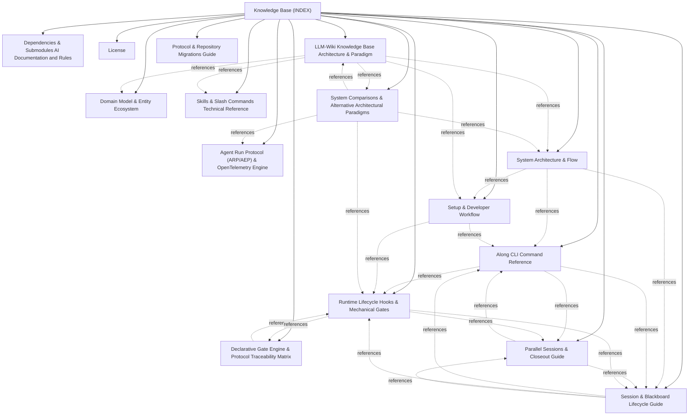

# ActDim Along - Knowledge Base Topic Index

Central entry point and cross-linked topic catalog for project documentation:

## Knowledge Graph & Topic Map

```mermaid
flowchart TD
    INDEX["Knowledge Base (INDEX)"]
    T_AGENT_RUN_PROTOCOL["Agent Run Protocol (ARP/AEP) & OpenTelemetry Engine"]
    INDEX --> T_AGENT_RUN_PROTOCOL
    T_ARCHITECTURE["System Architecture & Flow"]
    INDEX --> T_ARCHITECTURE
    T_CLI_REFERENCE["Along CLI Command Reference"]
    INDEX --> T_CLI_REFERENCE
    T_DECLARATIVE_GATES_AND_TRACEABILITY["Declarative Gate Engine & Protocol Traceability Matrix"]
    INDEX --> T_DECLARATIVE_GATES_AND_TRACEABILITY
    T_DEPENDENCIES["Dependencies & Submodules AI Documentation and Rules"]
    INDEX --> T_DEPENDENCIES
    T_DOMAIN_MODEL["Domain Model & Entity Ecosystem"]
    INDEX --> T_DOMAIN_MODEL
    T_LICENSE["License"]
    INDEX --> T_LICENSE
    T_LLM_WIKI_ARCHITECTURE["LLM-Wiki Knowledge Base Architecture & Paradigm"]
    INDEX --> T_LLM_WIKI_ARCHITECTURE
    T_MIGRATIONS["Protocol & Repository Migrations Guide"]
    INDEX --> T_MIGRATIONS
    T_PARALLEL_SESSIONS["Parallel Sessions & Closeout Guide"]
    INDEX --> T_PARALLEL_SESSIONS
    T_RUNTIME_HOOKS_AND_GATES["Runtime Lifecycle Hooks & Mechanical Gates"]
    INDEX --> T_RUNTIME_HOOKS_AND_GATES
    T_SESSION_LIFECYCLE["Session & Blackboard Lifecycle Guide"]
    INDEX --> T_SESSION_LIFECYCLE
    T_SETUP_AND_WORKFLOW["Setup & Developer Workflow"]
    INDEX --> T_SETUP_AND_WORKFLOW
    T_SKILLS_REFERENCE["Skills & Slash Commands Technical Reference"]
    INDEX --> T_SKILLS_REFERENCE
    T_SYSTEM_COMPARISONS["System Comparisons & Alternative Architectural Paradigms"]
    INDEX --> T_SYSTEM_COMPARISONS
    T_ARCHITECTURE -.->|references| T_CLI_REFERENCE
    T_ARCHITECTURE -.->|references| T_SETUP_AND_WORKFLOW
    T_ARCHITECTURE -.->|references| T_SESSION_LIFECYCLE
    T_CLI_REFERENCE -.->|references| T_RUNTIME_HOOKS_AND_GATES
    T_CLI_REFERENCE -.->|references| T_PARALLEL_SESSIONS
    T_CLI_REFERENCE -.->|references| T_SESSION_LIFECYCLE
    T_DECLARATIVE_GATES_AND_TRACEABILITY -.->|references| T_RUNTIME_HOOKS_AND_GATES
    T_LLM_WIKI_ARCHITECTURE -.->|references| T_SYSTEM_COMPARISONS
    T_LLM_WIKI_ARCHITECTURE -.->|references| T_ARCHITECTURE
    T_LLM_WIKI_ARCHITECTURE -.->|references| T_DOMAIN_MODEL
    T_LLM_WIKI_ARCHITECTURE -.->|references| T_SKILLS_REFERENCE
    T_LLM_WIKI_ARCHITECTURE -.->|references| T_SETUP_AND_WORKFLOW
    T_PARALLEL_SESSIONS -.->|references| T_SESSION_LIFECYCLE
    T_PARALLEL_SESSIONS -.->|references| T_CLI_REFERENCE
    T_RUNTIME_HOOKS_AND_GATES -.->|references| T_DECLARATIVE_GATES_AND_TRACEABILITY
    T_RUNTIME_HOOKS_AND_GATES -.->|references| T_PARALLEL_SESSIONS
    T_RUNTIME_HOOKS_AND_GATES -.->|references| T_SESSION_LIFECYCLE
    T_SESSION_LIFECYCLE -.->|references| T_CLI_REFERENCE
    T_SESSION_LIFECYCLE -.->|references| T_RUNTIME_HOOKS_AND_GATES
    T_SESSION_LIFECYCLE -.->|references| T_PARALLEL_SESSIONS
    T_SETUP_AND_WORKFLOW -.->|references| T_RUNTIME_HOOKS_AND_GATES
    T_SETUP_AND_WORKFLOW -.->|references| T_CLI_REFERENCE
    T_SYSTEM_COMPARISONS -.->|references| T_LLM_WIKI_ARCHITECTURE
    T_SYSTEM_COMPARISONS -.->|references| T_RUNTIME_HOOKS_AND_GATES
    T_SYSTEM_COMPARISONS -.->|references| T_AGENT_RUN_PROTOCOL
    T_SYSTEM_COMPARISONS -.->|references| T_ARCHITECTURE
```

---

## Articles

- **[Agent Run Protocol (ARP/AEP) & OpenTelemetry Engine](./topic--agent-run-protocol.md)** (architecture) `telemetry`, `opentelemetry`, `openinference`, `tracing`, `arp`, `aep`, `redactor`, `offloader`, `spool`
- **[System Architecture & Flow](./topic--architecture.md)** (architecture) `architecture`, `boundaries`, `multi-agent`, `blackboard`, `concurrency`, `ast`, `flow`
- **[Along CLI Command Reference](./topic--cli-reference.md)** (reference) `cli`, `commands`, `router`, `lifecycle`, `tools`, `reference`
- **[Declarative Gate Engine & Protocol Traceability Matrix](./topic--declarative-gates-and-traceability.md)** (architecture) `hooks`, `gates`, `declarative`, `traceability`, `verification`, `protocol`, `predicates`
- **[Dependencies & Submodules AI Documentation and Rules](./topic--dependencies.md)** (topic) `dependencies`, `ai-context`, `submodules`, `vendor`, `rules`
- **[Domain Model & Entity Ecosystem](./topic--domain-model.md)** (domain-model) `domain-model`, `entities`, `schemas`, `dag`, `metadata`, `issues`, `milestones`, `risks`, `spikes`, `checklists`, `sessions`
- **[License](./topic--license.md)** (license) `license`, `mit`
- **[LLM-Wiki Knowledge Base Architecture & Paradigm](./topic--llm-wiki-architecture.md)** (topic) `llm-wiki`, `architecture`, `knowledge-base`, `token-efficiency`, `indexing`, `methodology`, `search`, `karpathy`
- **[Protocol & Repository Migrations Guide](./topic--migrations.md)** (guide) `migrations`, `upgrade`, `protocol`, `changelog`, `versioning`, `data-safety`
- **[Parallel Sessions & Closeout Guide](./topic--parallel-sessions.md)** (guide) `session`, `parallel`, `closeout`, `attribution`, `ledger`, `commit`, `readiness`, `approval`
- **[Runtime Lifecycle Hooks & Mechanical Gates](./topic--runtime-hooks-and-gates.md)** (architecture) `hooks`, `gates`, `runtime`, `enforcement`, `antigravity`, `claude`, `codex`, `typography`, `cli-safety`, `circuit-breaker`, `attribution`
- **[Session & Blackboard Lifecycle Guide](./topic--session-lifecycle.md)** (guide) `session`, `blackboard`, `plan`, `trace`, `wrap`, `purge`, `issue-done`, `session-log`, `gates`
- **[Setup & Developer Workflow](./topic--setup-and-workflow.md)** (setup-workflow) `setup-workflow`, `installation`, `lifecycle`, `runners`, `developer-workflow`, `testing`
- **[Skills & Slash Commands Technical Reference](./topic--skills-reference.md)** (reference) `skills`, `commands`, `reference`, `runners`, `lifecycle`, `automation`, `multi-agent`
- **[System Comparisons & Alternative Architectural Paradigms](./topic--system-comparisons.md)** (explanation) `comparisons`, `architecture`, `paradigms`, `memory`, `zero-vector`, `mechanical-gates`, `governance`, `engineering-decisions`

---

## Related Context

- [AGENTS.md](../AGENTS.md): Active protocol conventions and rules.
- [Decisions (ADRs)](./decisions/INDEX.md): Architectural Decision Records.
- [Domain Model & Entity Ecosystem](./topic--domain-model.md): Specifications for active issues and project history.
