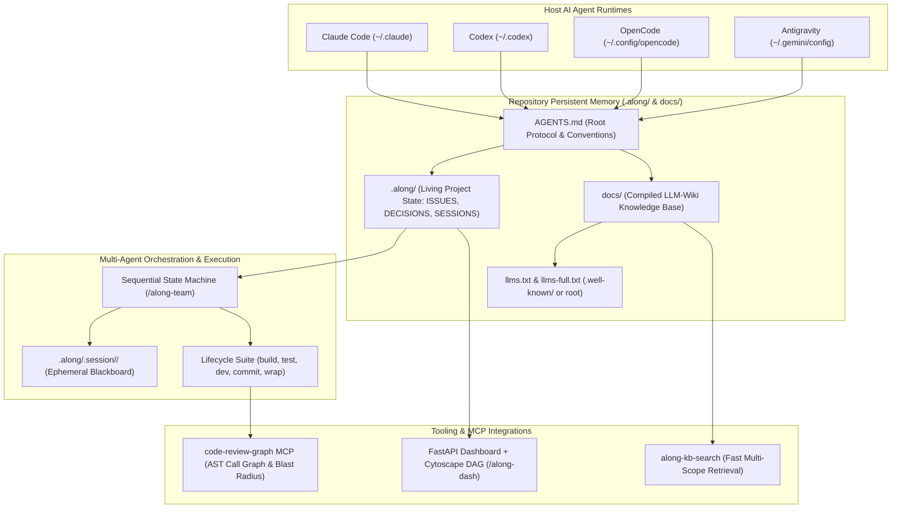
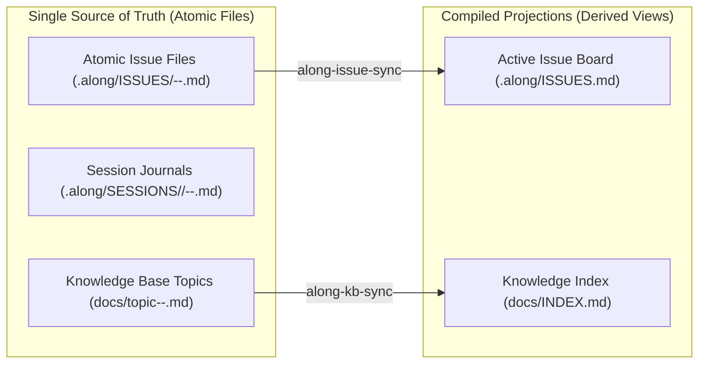
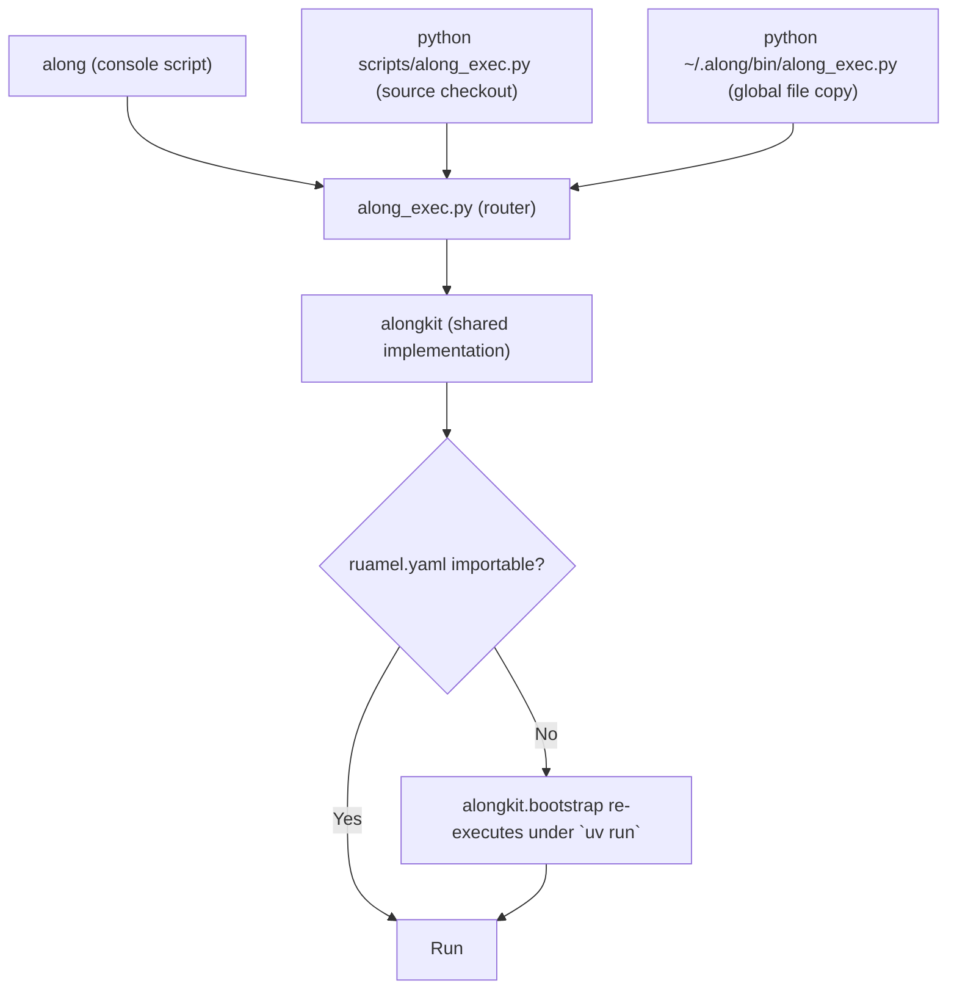
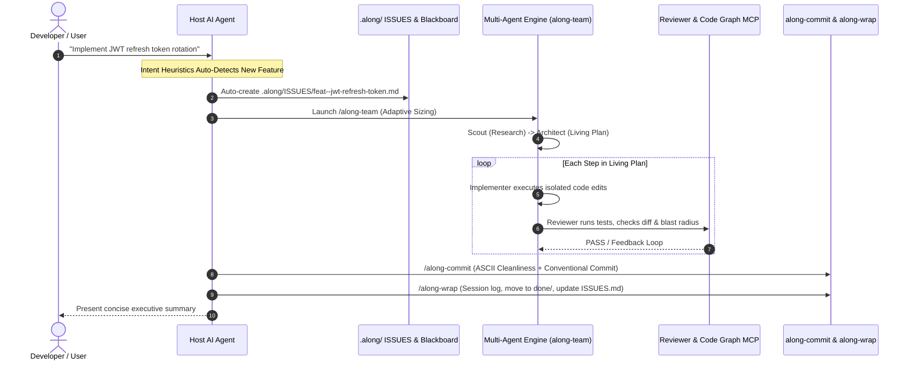
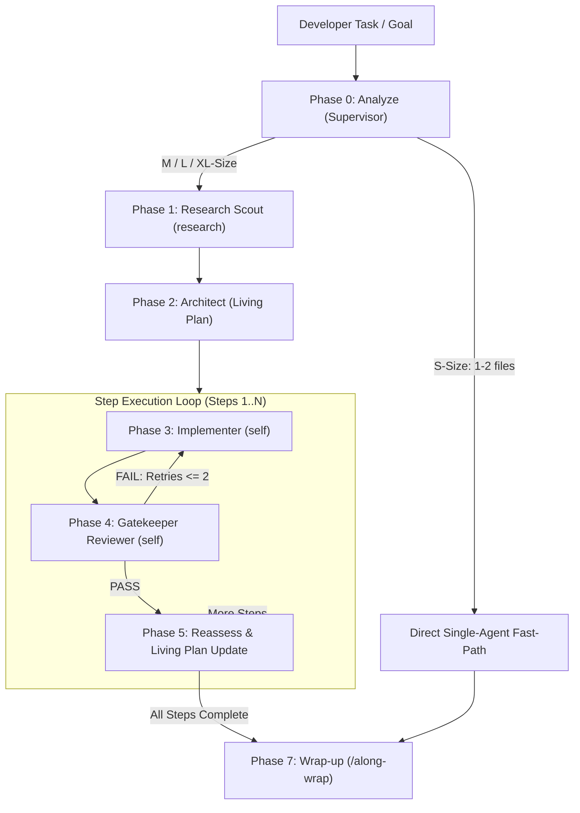
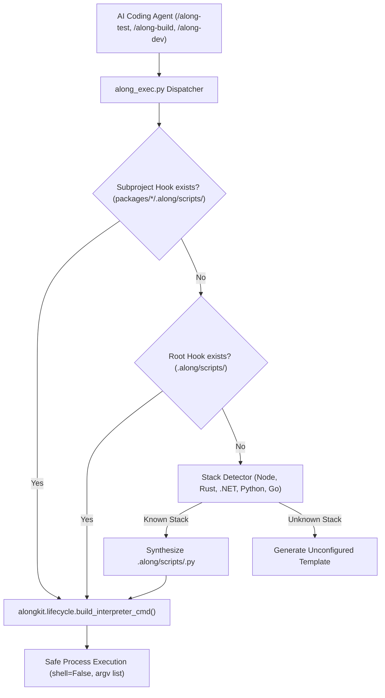

# System Architecture & Flow

Along (`actdim-along`) is a provider-agnostic agent-context, project memory, and documentation protocol designed to give software repositories a persistent, durable, token-efficient, and human-readable context layer.

---

## 1. System Topology & Architecture

Along operates as a modular, three-layer architecture spanning host AI agent runtimes, repository-native persistent memory, and integrated execution tooling:

---

## 2. Provider Compatibility & Discovery Paths

Along avoids vendor lock-in by utilizing standard agent discovery paths without requiring custom binary daemons:

| Host Agent | Discovery & Context Entry Point | Skills Installation Target | Execution Mechanism |
| :--- | :--- | :--- | :--- |
| **Claude Code** | Reads `CLAUDE.md`, which references `@AGENTS.md`. | `~/.claude/skills/along-*/` | Direct slash commands (`/along-*`) and MCP tools. |
| **Codex** | Reads `AGENTS.md` natively on session initialization. | `~/.codex/skills/along-*/` | Native skill execution and prompt injection. |
| **OpenCode** | Reads `AGENTS.md` and `CLAUDE.md` natively. | `~/.config/opencode/commands/along-*.md` | Flat markdown command declarations. |
| **Google Antigravity** | Reads `AGENTS.md` (or `GEMINI.md`) natively. | `~/.gemini/config/skills/along-*/` | Slash commands, `/goal` autonomy, and MCP tools. |

---

## 3. Nearest Context Boundary & Subproject Localization

In multi-package monorepos, Git submodules, or symlinked component libraries (`packages/*`, `libs/*`, `modules/*`), Along enforces **Strict Subproject Localization** via the Anti-Root Pollution Rule:

1. **Nearest `.along/` Boundary**: Any subfolder may contain its own `AGENTS.md` and `.along/`. Agents MUST evaluate and write entities (`ISSUES/`, `SESSIONS/`, `DECISIONS.md`, `HISTORY.md`) to the **NEAREST** `.along/` corresponding to the modified files.
2. **Submodule Isolation**: When fixing a defect or adding a feature inside a Git submodule or shared library, the issue ticket, ADR, session log, and history line are recorded directly in that submodule's `.along/`.
3. **Parent Orchestration**: The workspace root `.along/` is reserved strictly for whole-solution orchestration, top-level integration tasks, and cross-package architectural ADRs. Parent issues reference subproject issues via canonical keys (e.g. `[pkg-auth:feat--token-refresh]`), never by copying internal history.

---

## 4. Multi-Branch Concurrency & Git File Model

Collaborative software development requires parallel feature branches without merge conflicts on tracking files. Along solves this through a formal distinction between SSOT entities and derived projections:

### Single Source of Truth (SSOT) vs Derived Projections

1. **Atomic SSOT Files**: Each issue (`.along/ISSUES/<type>--<slug>.md`) and session journal (`.along/SESSIONS/<YYYY>/<date>--<slug>.md`) is an isolated Markdown file with YAML front-matter. Parallel branches create distinct files, resulting in zero Git merge collisions.
2. **Derived Projections & Export Artifacts**: `.along/ISSUES.md` and `docs/INDEX.md` are dynamically compiled views tracked in Git as entry points. Under the **Zero-Manual-Merge Rule**, developers and agents never resolve Git conflicts in projection files manually: accept either version and run `/along-issue-sync` or `/along-kb-sync` to recompile cleanly from source. Generated dashboards (`.along/dashboard.html`, `.along/DASHBOARD.md`) are untracked export artifacts kept out of Git via `.gitignore`.
3. **Append-Only Linear Merge Driver**: `.along/HISTORY.md` and `.along/DECISIONS.md` are append-only. `.gitattributes` configures `merge=union` for these files, enabling Git to automatically combine appended entries from concurrent branches without conflicts.

---

## 5. Engine Implementation Layer (`scripts/` and `scripts/alongkit/`)

The eighteen skills are thin: every one of them dispatches to a Python engine in `scripts/`.
Those engines share one implementation package, `scripts/alongkit/`, introduced in v3.0.0.

Before it existed, the engines were twelve standalone programs with no shared module.
`find_repo_root` had five divergent copies that disagreed on what a repository root is,
front-matter parsing had four, and `subprocess.run` was called at 25+ sites with no shared
convention, which is how one encoding defect reached every engine at once. The demonstrated
cost is recorded in `[bug--adr-retrieval-blind-to-slug-headers]`: the ADR header format
changed in v2.2.0, was updated where ADRs are written and validated, and was missed in the
reader, so ADR search returned zero results in every released version.

| Module | Owns |
| :--- | :--- |
| `alongkit/repo.py` | Repository root markers, nearest `.along/` discovery, engine resolution, directory walking and the shared ignore set. |
| `alongkit/frontmatter.py` | The single YAML front-matter reader and writer (`ruamel.yaml`, round-trip). |
| `alongkit/entities.py` | Entity vocabulary, canonical keys, slugs, dates, ADR record parsing and formatting. |
| `alongkit/proc.py` | Subprocess execution with UTF-8 fixed on both sides of the pipe. |
| `alongkit/textio.py` | Strict reads, line-ending preservation, atomic writes. |
| `alongkit/markdown.py` | Link parsing, fenced-code tracking, GitHub heading anchors, and link resolution. |
| `alongkit/typography.py` | The forbidden-character table, shared with the quality gate. |
| `alongkit/sanitizer.py` | Which files that table governs, strict reads, the modes, and the JSON report. |
| `alongkit/gates.py` | Pre-commit and pre-release test, typography, and Markdown link gates. |
| `alongkit/transaction.py` | Snapshot and byte-exact rollback around a multi-file mutation. |
| `alongkit/migration.py` | Collision policy, on-disk backup, and the dry-run plan behind the migration engine. |
| `alongkit/semver.py` | Version parsing, increments, comparison. |
| `alongkit/version.py` | The protocol version constant, declared exactly once. |
| `alongkit/bootstrap.py` | Dependency resolution for a directly invoked engine. |
| `alongkit/cli.py` | The `along` console entry point, which delegates to the `along_exec.py` router. |

### Front-matter and the runtime dependency

Front-matter is YAML because tools that are not Along read it: GitHub, static site
generators, `gray-matter`. The engines therefore use a real YAML implementation rather than
a bespoke parser. `ruamel.yaml` is chosen over `pyyaml` because round-trip mode preserves
comments, key order, and quoting style, which is what makes editing a file the user owns
safe. Reads are strict and refuse a block they cannot understand; edits name individual
keys and leave every other line byte-identical.

See [ADR-2026-09-01--frontmatter-on-ruamel-yaml](../.along/DECISIONS.md) and
[ADR-2026-09-01--shared-engine-package](../.along/DECISIONS.md).

### The typography rule: what it governs, and who may rewrite

Two modules, deliberately split. `alongkit/typography.py` is the character table and a
pure string transformation; it never opens a file. `alongkit/sanitizer.py` owns every
decision that touches a user's disk.

| Question | Answer |
| :--- | :--- |
| Which files? | `.md`, `.py`, `.sh`, `.ps1`, `.bat`. Data files (`.json`, `.yaml`, `.yml`, `.toml`) only with `--include-data`. Localized resource directories (`locales/`, `i18n/`, `translations/`, ...) never. |
| Which directories? | All of them, hidden included, so a byte order mark in `.along/**` is finally visible. Excludable per repository with `.alongsanitizeignore` or `--exclude`. |
| Who may write? | Only an explicit `--write` (standalone) or `--fix-typography` (commit, release). The gates verify and abort. |
| What about a file that is not UTF-8? | Skipped, reported by path with the decode reason, left byte-identical. Never decoded lossily and rewritten. |
| What about line endings? | Preserved verbatim. Nothing parses `.gitattributes`, because preserving what a file already uses cannot contradict it. |
| What do callers consume? | `sanitizer.Report` (`--json` on stdout, human output on stderr), never printed text. |

The previous implementation did the opposite of each row and ran that way unattended
before every commit and every release. See
[ADR-2026-09-01--typography-rule-scope](../.along/DECISIONS.md).

### Gates precede mutations, and mutations roll back

A gate that reports after the fact is not a gate. The release engine used to bump the
version, rewrite the tree with the sanitizer, flip the milestone to `completed`, and
regenerate the dashboard, and only then run the tests - and only when `--commit` was
passed. When they failed it printed "Release aborted" and exited over a tree that was
already half-released, with nothing to undo it.

Two rules follow, and `[bug--release-engine-mutates-before-tests-and-reinstalls-globals]`
records what each of them cost:

1. **Every gate runs on the untouched tree, unconditionally.** Tests, the typography check,
   and the Markdown link check all run before the first byte is written, whatever flags the
   invocation carries. `--no-verify` is the single documented way past them.
2. **Every mutation is recorded.** `alongkit/transaction.py` snapshots a file's exact bytes
   (or its absence) before anything writes to it. On failure the transaction restores each
   one and names it; a mutation it cannot undo - a project's own
   `.along/scripts/bump_version.py` writing paths the engine cannot see - is reported
   rather than assumed away. The transaction closes at the git commit, past which a
   rollback would destroy committed work instead of repairing anything.

The release also stages only the paths it wrote, rather than `git add -A`, and touches no
machine-global state: it used to finish by running `install.ps1 -Target all`, which then
deleted and recreated `~/.claude/rules`. Installing no longer deletes that directory
either; see the next section.

### An installer never deletes what it did not write

Both installers copied their artifacts over a destination they had just removed
(`Remove-Item -Recurse -Force ~/.claude/rules`), which took the user's own rule files with
it on every run. The delete existed to stop superseded files accumulating, so it is
replaced by knowledge rather than by force: `install_manifest.py` records every path an
install wrote into `~/.along/install-manifest.json`, and the next run removes, by name,
only the files the previous install wrote and this one no longer ships. The same record is
what `-Uninstall` / `--uninstall` reads.

The layout itself is described once, in `alongkit.install.planned_files`, and both
installers are measured against it end to end, so `install.sh` cannot again ship without
the rule packs the way it did for months. MCP registration moved to `configure_mcp.py`
with a per-provider contract: the previous installers wrote five configuration files, four
of which no provider reads, and printed a success line for each.

### A migration merges; it does not choose a winner

The same failure in a different shape. The migration engine moved legacy `.agents/`
content onto `.along/` by deleting the destination first, so a repository that held both -
a partial migration, or two branches migrating separately - lost the newer `DECISIONS.md`
and `HISTORY.md`. Both are append-only by protocol, so nothing could bring them back.

`alongkit/migration.py` makes the destination untouchable. On a collision the file class
decides: append-only files are union-merged the way `.gitattributes` already merges them
across branches, derived projections keep the destination and drop the legacy copy for
recompilation, and anything else keeps the destination with the legacy copy preserved
beside it as `<name>.legacy.md`. Before the first change the state directories are copied
to `.along/.migration-backup/<timestamp>/`, and the copy ignores itself so it never enters
history.

Where the release engine needs an in-memory transaction - undo everything, the tests
failed - a migration needs the opposite: a durable copy that outlives the process, because
it is meant to be run, inspected, and re-run. What the two share is the rule that produced
both defects: an operation that writes before it is sure, and cannot be undone, has no
business being unattended. Which is why the migration is a dry run for every caller that
is not a human at a terminal, and why installing no longer migrates at all. See
[ADR-2026-09-01--migration-never-deletes-a-destination](../.along/DECISIONS.md).

### Three invocation paths, one package

Python places the running script's own directory on `sys.path`, and the installers copy
`alongkit/` next to the engines, so `from alongkit import ...` resolves in a flat
`~/.along/bin/` install with no path manipulation and no package install. When the
interpreter lacks `ruamel.yaml`, `alongkit.bootstrap` re-executes the engine under
`uv run` once; if `uv` is absent it exits with an actionable message rather than a
traceback.

### Structural guards

Two tests keep the duplication from growing back
([tests/test_alongkit.py](../tests/test_alongkit.py)):

- no name may be defined at module level in two different engines;
- no engine may redefine a name the shared package already owns.

A third asserts that an engine still runs from a flat directory copy, and a fourth that
both installers carry the package.

A fifth structural gate enforces clean exception handling (`alongkit.gates.exception_handling_gate`),
verifying via AST analysis that zero bare `except:` or swallowed generic `except Exception: pass`
clauses exist across `scripts/` and `dashboard/`. Internal engine errors and skipped entity files
are systematically reported and recorded through centralized telemetry in `alongkit.diagnostics`
(`try_record_incident`). See [ADR-2026-09-09--error-handling-and-failure-visibility](../.along/DECISIONS.md).

Two more guard the suite itself
([tests/test_zz_hermetic_suite.py](../tests/test_zz_hermetic_suite.py)): the working tree
must be byte-identical before and after a run, and no test may build an engine command
line whose target is the repository root. Engines write, so a test that passes the real
root can rewrite project memory mid-session; fixtures come from
[tests/hermetic.py](../tests/hermetic.py). See
[Writing Tests: the Hermetic Rule](./topic--setup-and-workflow.md).

---
## 6. End-to-End Human & Developer Workflow

The lifecycle of a task in Along follows a structured, low-friction flow designed to eliminate administrative burden for the developer:

1. **Intent Recognition (Zero-Friction Tracking)**: Natural developer prompts ("Build feature X", "Fix bug Y", "Investigate library Z") automatically trigger the creation of typed issues (`feat`, `bug`, `spike`) in `.along/ISSUES/` without requiring manual file management.
2. **Mandatory Issue Anchoring**: All non-trivial code modifications must bind to an active issue in `.along/ISSUES/` with `status: in-progress`.
3. **Autonomous Execution**: The agent executes the task via `/along-team` or direct fast-path.
4. **Verification Gate**: Automated tests, file integrity audits, and AST blast radius checks are executed before finalizing changes.
5. **Issue-Linked Commits**: `/along-commit` checks typography (clean ASCII) and formats Conventional Commits linked directly to the issue slug.
6. **Session Wrap-Up**: `/along-wrap` moves finished issues to `.along/ISSUES/done/`, reconciles `ISSUES.md`, records `.along/SESSIONS/`, and appends to `HISTORY.md`.

---

## 7. Deep Architectural Rationale: Multi-Agent State Machine vs Single-Agent Linear Execution

A core architectural decision in Along is the deployment of a **Sequential Multi-Agent State Machine** (`/along-team`) instead of unconstrained single-agent linear execution.

### Why Single-Agent Linear Execution Fails on Complex Tasks

When a single LLM agent attempts to research, plan, write code, run tests, and review its own output in a single continuous conversation context, it inevitably succembers to three fundamental failure modes:

1. **Prompt Pollution & Context Saturation**:
   - Running terminal searches, directory listings, and build outputs dumps thousands of raw tokens into the context window.
   - By the time the agent reaches the implementation phase, the prompt is saturated with irrelevant tool noise, degrading the model's reasoning capabilities and causing context truncation.
2. **Author Bias & Hallucinated Test Passes**:
   - The same agent instance that wrote the code has severe confirmation bias. When verifying its own changes, it routinely overlooks edge cases, ignores unhandled exceptions, and accepts superficial test runs.
3. **Plan Drift on AST/Build Errors**:
   - When encountering a compilation or runtime error, a single linear agent tends to make hasty, localized patches without reassessing the overarching system architecture, leading to architectural debt.

### The Multi-Agent Sequential State Machine Solution

Along replaces unstructured chat swarms and single-agent linear loops with a deterministic **5-Phase State Machine**:

### Adaptive Complexity Routing (T-Shirt Sizing)

Multi-agent execution introduces context switching overhead. Therefore, Along enforces strict **Adaptive Complexity Routing**:

- **`S-Size` Tasks (1-2 files, clear scope, minor bug/tweak)**:
  - *Strategy*: **Fast-Path Single-Agent Execution**. Subagents are **NOT** spawned. The primary agent directly applies edits, runs tests, and completes the task, preserving token budget.
- **`M-Size` Tasks (3-5 files, isolated module/route)**:
  - *Strategy*: **Fast Loop** (Scout -> Worker -> Reviewer) in a single linear pass.
- **`L / XL-Size` Tasks (Cross-module refactorings, protocol changes, new subsystems)**:
  - *Strategy*: **Full State Machine** with dynamic Living Plan, step-by-step worker subagents, independent gatekeeper review, and reassess cycles.

### The 5 Specialized Roles & Strict Contracts

Along establishes 5 clearly separated functional roles:

1. **Supervisor (Lead Orchestrator)**:
   - *Responsibility*: Requirement extraction (`REQ-1`, `REQ-2`), acceptance criteria enforcement, task sizing, and gatekeeping. Runs in parent context; never writes low-level code directly in L/XL tasks.
   - *Context Pruning Rule*: The Supervisor strictly strips raw search logs and tool output from the Scout, passing only distilled facts (target files, constraints, AST symbols) to the Implementer.
2. **Researcher (Scout)**:
   - *Responsibility*: Read-only discovery. Maps existing code patterns, dependencies, and potential risks without touching file contents (`TypeName: "research"`, `enable_write_tools: false`).
3. **Architect**:
   - *Responsibility*: Executes Public Surface Discovery (searching for all mirrors across `README.md`, `AGENTS.md`, `docs/`) and converts scout findings into a concrete **Living Plan** composed of 2 to 5 verifiable steps mapped directly to `REQ-N`.
4. **Implementer (Worker)**:
   - *Responsibility*: Executes the specific step in an isolated context (`TypeName: "self"`, `Workspace: "branch"` or `"inherit"`). Focuses exclusively on the assigned step without worrying about global orchestration.
5. **Reviewer (Gatekeeper: Tester + Critic + Judge)**:
   - *Responsibility*: Evaluates the implementer's changes in an isolated context against the mandatory **6-Point Verification Rubric**:
     1. *Zero-Byte & File Integrity Gate*: `git status -u` check ensuring `size > 0` and zero empty placeholders.
     2. *Automated Test Suite*: Runs `/along-test` ensuring zero failures and increased test coverage.
     3. *Diff & Scope Audit*: Verifies that only requested files were touched without unintended edits.
     4. *Requirement Coverage Gate*: Verifies 100% satisfaction of every `REQ-N` from the initial user prompt.
     5. *AST Blast Radius & ADR Compliance*: Verifies downstream callers and checks conformance with `.along/DECISIONS.md`.
     6. *Documentation & Public Surface Parity*: Ensures both internal `docs/topic--*.md` and public entry points (`README.md`, `AGENTS.md`) reflect modifications without drift.
     7. *Clean ASCII & Typography*: Validates clean UTF-8 without forbidden typographic characters.

---

## 8. Ephemeral Session Blackboard Memory

To prevent multi-agent coordination data from leaking across sessions or cluttering the git history, Along establishes an **Ephemeral Session Blackboard**:

- **Location**: `.along/.session/<issue-slug>/` (automatically excluded in `.gitignore`).
- **Artifacts**:
  - `plan.md`: The active Living Plan updated across step loops.
  - `scout_findings.json`: Distilled symbols, dependencies, and constraints.
  - `step_reviews/`: Reviewer reports and verdicts per step.
  - `blackboard.json`: Shared in-session state, mocks, and intermediate variables.
- **Lifecycle & Automated Garbage Collection**:
  1. *Allocated*: Created at the start of `/along-team` or autonomous goal execution.
  2. *Updated*: Maintained dynamically during step execution.
  3. *Distilled*: Key achievements, decisions, and diff summaries are extracted into `.along/SESSIONS/<YYYY>/<date>--<slug>.md`.
  4. *Purged*: The entire `.along/.session/<slug>/` directory is automatically deleted during `/along-wrap`.

---

## 9. Historical Analysis: Documentation Truncation Incident & Prevention

During the transition to the LLM-Wiki architecture in commit `5bab25dc5b3e57c0e83b23f47b7ce221773a6e90` (2026-08-30), an automated file renaming routine accidentally replaced populated documentation files (`01-architecture.md`, `02-domain-model.md`, `03-setup-and-workflow.md`) with 13-line placeholder templates. Subsequent feature PRs updated internal skill instructions while failing to backfill the public `docs/` Knowledge Base.

### Institutionalized Quality Gates

To guarantee that documentation remains synchronized with code and is never silently truncated:
1. **Mandatory Post-Batch & Destructive Operation Audit Gate**: After executing any batch replacement, migration script, refactoring tool, or multi-file rewrite, agents MUST immediately run `git diff --stat` to verify that net line counts and file sizes align with expectations. Any unexpected net reduction in file size or line count must be inspected in detail before proceeding.
2. **Anti-Stub & Size Regression Invariant**: Automated test suite (`test_21_docs_articles_not_empty_placeholders`) and Reviewer rubrics reject any file modification that reduces substantial documentation or code to empty placeholder stubs or skeleton templates.
3. **Documentation Blast Radius Gate**: Mandatory in `/along-wrap` and `AGENTS.md`. Whenever public interfaces, commands, or system architectures change, the affected `docs/topic--*.md` articles MUST be updated before closing an issue.
4. **Link Integrity Gate (`along-kb-sync --strict`)**: Verifies that all cross-references across `docs/`, `README.md`, and `.along/` resolve to valid physical files.

---

## 10. Lifecycle & Polyglot Hook Architecture (`alongkit.lifecycle`)

Along decouples AI agent operational intent from underlying repository toolchains through the **Contract-First Lifecycle Hook Architecture**:

### Architectural Principles

1. **Stack-Agnostic Interface**: AI agents interact exclusively with standardized verbs (`/along-build`, `/along-test`, `/along-dev`, `/along-version-bump`, `/along-dep-scan`). The agent never needs custom prompt tuning for different languages.
2. **Polyglot Interpreter Selection**:
   - `.py`: Executed via `sys.executable`.
   - `.sh`: Executed via `bash` binary.
   - `.ps1`: Executed via `pwsh` or `powershell` with `-NoProfile -File`.
   - `.bat` / `.cmd`: Executed via `cmd.exe /c`.
   - Native binaries: Executed directly.
3. **Safe Execution without Shell Injection**: All lifecycle commands avoid `shell=True`. Arguments are pre-split or passed as discrete argv lists, preserving spaces and special characters.
4. **Nearest-Boundary Monorepo Localization**: In modular codebases and Git submodules, the dispatcher locates the nearest `.along/scripts/` hook before falling back to workspace root.
5. **Non-Destructive Auto-Synthesis**: When hooks are absent, Along analyzes project manifests (`package.json`, `Cargo.toml`, `*.csproj`, `pyproject.toml`, `go.mod`), injects quiet flags (`-q`, `--silent`), and synthesizes an executable `.along/scripts/<action>.py` hook marked with `# Status: verified`.
