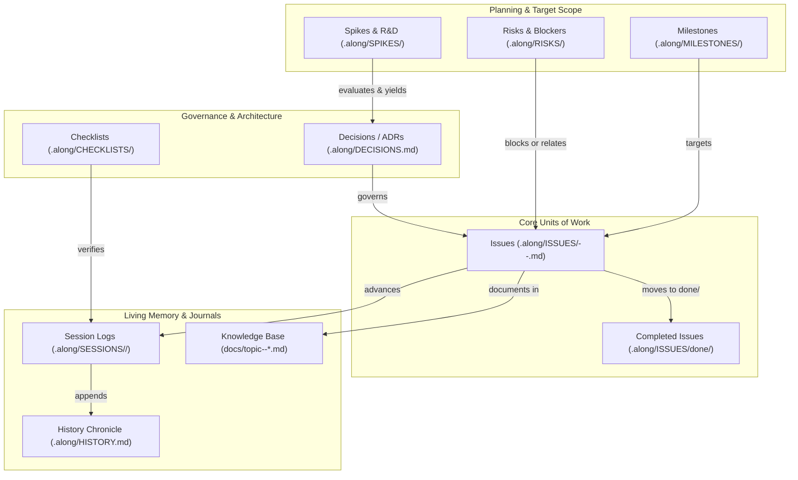

# Domain Model & Entity Ecosystem

Along models repository memory, project tracking, and documentation as a strongly-typed, schema-validated **Directed Acyclic Graph (DAG)** of Markdown entities with YAML front-matter (`protocol: along`).

---

## 1. Entity Ecosystem Architecture

The entity ecosystem provides a structured data layer that is simultaneously human-readable in plain Markdown, machine-parsable by local scripts and dashboards, and token-efficient for AI agents:



---

## 2. Granular Entity Taxonomy & Schemas

Along defines 9 distinct entity types, each fulfilling a specific role in repository memory and lifecycle management:

### 1. Issues (`.along/ISSUES/<type>--<slug>.md`)
Atomic units of engineering work. Along categorizes issues into **5 distinct types**:

| Issue Type | Purpose & Scope | Example Slug |
| :--- | :--- | :--- |
| **`feat`** | New functional capabilities, user-facing features, API endpoints, or skills. | `feat--jwt-token-refresh` |
| **`bug`** | Defect repairs, regression fixes, edge-case remediation, or error recovery. | `bug--windows-path-escaping` |
| **`debt`** | Technical debt payoff, code refactoring, performance optimization, or dead code elimination. | `debt--dynstruct-migration` |
| **`task`** | Routine chores, infrastructure setup, CI/CD configuration, or dependency updates. | `task--setup-vitest-runner` |
| **`docs`** | Knowledge base authoring, architectural specifications, or developer workflow guides. | `docs--skills-architecture-overhaul` |

#### YAML Front-Matter Schema:
```yaml
---
protocol: along
protocol_version: "2.2.6"
slug: jwt-token-refresh
type: feat
status: in-progress
priority: high
created: 2026-09-01
updated: 2026-09-01
completed: null
agent: antigravity
tags: [auth, security, tokens]
milestone: v2.3.0-security
blocked_by: [feat--db-schema-migrations]
related: [risk--token-revocation-latency]
parent: feat--identity-platform
---

# Issue Title

Detailed problem statement, constraints, and verifiable acceptance criteria.

## Acceptance Criteria
- [ ] Implement refresh token rotation endpoint.
- [ ] Add 100% test coverage for expired tokens.
- [ ] Update docs/topic--architecture.md.
```

#### Lifecycle States:
- **`open`**: Backlog item, not currently being executed.
- **`in-progress`**: Actively being developed by an agent or human. Non-trivial code edits require an active issue.
- **`blocked`**: Waiting on an external dependency (`blocked_by`), API key, or active risk.
- **`done`**: Fully implemented, verified by tests and code review. Mandatory field `completed: YYYY-MM-DD` is set, and the file is moved to `.along/ISSUES/done/<type>--<slug>.md`.

---

### 2. Architectural Decision Records (ADRs) (`.along/DECISIONS.md`)
Single-file append-only log of non-trivial technical and architectural decisions.

#### Why Single-File Append-Only over Multi-File MADR/Nygard?
- **Single-Shot Context Load**: Agents read all active architectural constraints in a single tool call (< 300 tokens) at session start, without scanning multiple files.
- **Zero Lifecycle Moving Overhead**: Unlike issues, decisions are immutable; they are never renamed or moved.
- **Merge Collision Prevention**: Each entry uses a decentralized slug header (`## ADR-YYYY-MM-DD--<slug> - <Title>`), allowing `.gitattributes` (`merge=union`) to merge parallel branches cleanly without conflicts.

#### Schema & Entry Format:
```markdown
## ADR-2026-08-31--session-scoped-blackboard-memory - Session-Scoped Blackboard Memory
- Date: 2026-08-31
- Status: accepted (or: superseded by ADR-YYYY-MM-DD--<slug>)
- Context: In-flight multi-agent coordination data cluttered conversation context.
- Decision: Introduce .along/.session/<slug>/ with automated GC during /along-wrap.
- Consequences: Eliminates state leakage; guarantees clean repository hygiene.
```

---

### 3. Milestones & Sprints (`.along/MILESTONES/<slug>.md`)
Group multiple issues into structured release targets, sprints, or major project stages.

#### Schema:
```yaml
---
protocol: along
protocol_version: "2.2.6"
slug: v2.3.0-security
title: Security & Authentication Hardening
status: in-progress
due_date: 2026-09-15
created: 2026-09-01
target_issues:
  - feat--jwt-token-refresh
  - bug--auth-header-leak
  - debt--crypto-upgrade
progress_pct: 33
---
```

---

### 4. Risks & Blockers (`.along/RISKS/<slug>.md`)
Track external dependencies, rate limits, security considerations, and potential blockers before they halt development.

#### Schema:
```yaml
---
protocol: along
protocol_version: "2.2.6"
slug: token-revocation-latency
title: Redis Token Blacklist Synchronization Latency
severity: high
status: active
owner: agent
mitigation: Use short-lived 5-minute access tokens with asymmetric JWT signatures.
created: 2026-09-01
updated: 2026-09-01
---
```

---

### 5. Spikes & R&D Experiments (`.along/SPIKES/<slug>.md`)
Timeboxed research experiments, benchmark comparisons, and library evaluations conducted prior to architectural commitment.

#### Schema:
```yaml
---
protocol: along
protocol_version: "2.2.6"
slug: duckdb-vs-sqlite-benchmarks
title: Local Vector Indexing: DuckDB vs SQLite FTS5
status: concluded
hypothesis: SQLite FTS5 with BM25 ranking provides lower memory footprint and zero external C-extensions.
outcome: SQLite FTS5 outperformed DuckDB on snippet retrieval (<5ms) with zero dependencies.
resulting_adr: ADR-2026-08-30--llm-wiki-docs-architecture-and-singular-skills-refactoring
created: 2026-08-30
---
```

---

### 6. Checklists & Quality Gates (`.along/CHECKLISTS/<slug>.md`)
Reusable verification rubrics for pre-commit checks, stage completions, releases, and security audits.

#### Schema:
```yaml
---
protocol: along
protocol_version: "2.2.6"
slug: stage-completion
title: Mandatory Stage Completion Verification Checklist
category: stage-completion
items:
  - id: zero_byte_gate
    text: Verify git status -u has non-zero size for all created files.
    verified: true
  - id: unit_tests
    text: Run automated unit tests with quiet flags (zero failures).
    verified: true
  - id: blast_radius
    text: Check downstream callers via code-review-graph and map to docs.
    verified: true
---
```

---

### 7. Work Sessions (`.along/SESSIONS/<YYYY>/<YYYY-MM-DD>--<slug>.md`)
Chronological work journal recording accomplishments, touched files, reviewer feedback, and blast radius summaries for every working session.

#### Schema:
```yaml
---
protocol: along
date: 2026-09-01
slug: skills-architecture-overhaul
agent: antigravity
branch: main
commit: a1b2c3d
summary: Complete overhaul of docs/ Knowledge Base and full 18-skill reference.
milestone: v2.2.0-along
issues_advanced:
  - docs--comprehensive-knowledge-base-and-skills-architecture
issues_completed:
  - docs--comprehensive-knowledge-base-and-skills-architecture
decisions: []
risks_logged: []
spikes_conducted: []
---
```

---

### 8. Project History Chronicle (`.along/HISTORY.md`)
Single-line append-only chronological log of major milestones, features, and session completions:
```markdown
# History

2026-09-01 - skills-architecture-overhaul - antigravity - Rebuild Knowledge Base and 18-skill reference - [Session](./SESSIONS/2026/2026-09-01--skills-architecture-overhaul.md)
```

---

### 9. Knowledge Base (`docs/topic--*.md`, `docs/INDEX.md`)
Curated, cross-linked LLM-Wiki articles maintaining domain architecture, API contracts, dependencies, and developer guides.

---

## 3. Graph Invariance & Canonical Slug Linking

To prevent link breakage and dependency graph drift, Along enforces **Canonical Slug Invariance**:

1. **Canonical Key References**:
   - Entities reference other entities strictly by their canonical key (`<type>--<slug>` or `<slug>`), **NEVER** by filesystem paths (`.along/ISSUES/open/...`).
   - *Example*: `blocked_by: [feat--db-schema]` remains 100% valid when the target file moves from `.along/ISSUES/feat--db-schema.md` to `.along/ISSUES/done/feat--db-schema.md`.
2. **Unidirectional Graph Storage**:
   - In YAML front-matter, relationships are stored unidirectionally (`blocked_by: []`, `related: []`, `parent: <slug>`).
   - Reciprocal relationships (`blocks`, `children`) and full DAG topologies are computed dynamically by graph parsers and the Along dashboard engine, eliminating LLM synchronization drift.

---

## 4. Automated Intent Recognition Heuristics

To ensure zero administrative overhead for developers, Along host agents automatically infer project tracking actions from natural language prompts:

| Natural User Prompt / Trigger | Inferred Entity | Automatic Background Agent Action |
| :--- | :--- | :--- |
| *"Build feature X"*, *"Add endpoint Y"* | **`feat ISSUE`** | Auto-creates `.along/ISSUES/feat--<slug>.md` with `status: in-progress`. Updates `ISSUES.md`. |
| *"Fix bug X"*, *"Fix crash on Y"* | **`bug ISSUE`** | Auto-creates `.along/ISSUES/bug--<slug>.md` with `priority: high`. |
| *"Refactor module X"*, *"Clean up Y"* | **`debt ISSUE`** | Auto-creates `.along/ISSUES/debt--<slug>.md`. |
| *"Update documentation for X"* | **`docs ISSUE`** | Auto-creates `.along/ISSUES/docs--<slug>.md`. |
| *"Rate limit hit"*, *"Blocked on API key"* | **`RISK / BLOCKER`** | Auto-creates `.along/RISKS/<slug>.md` (`status: active`); marks issue `status: blocked`. |
| *"Benchmark X vs Y"*, *"Test if Z works"* | **`SPIKE`** | Auto-creates `.along/SPIKES/<slug>.md`. Documents outcome and logs resulting ADR in `DECISIONS.md`. |
| *"Target for next sprint"*, *"Release v2.0"* | **`MILESTONE`** | Auto-creates `.along/MILESTONES/<slug>.md`; binds target issues. |
| *"I'm done for today"*, *"Wrap up"* | **`SESSION & WRAP`** | Executes `/along-wrap`: verifies tests, records session log, moves completed issues to `done/`, updates `HISTORY.md`. |
