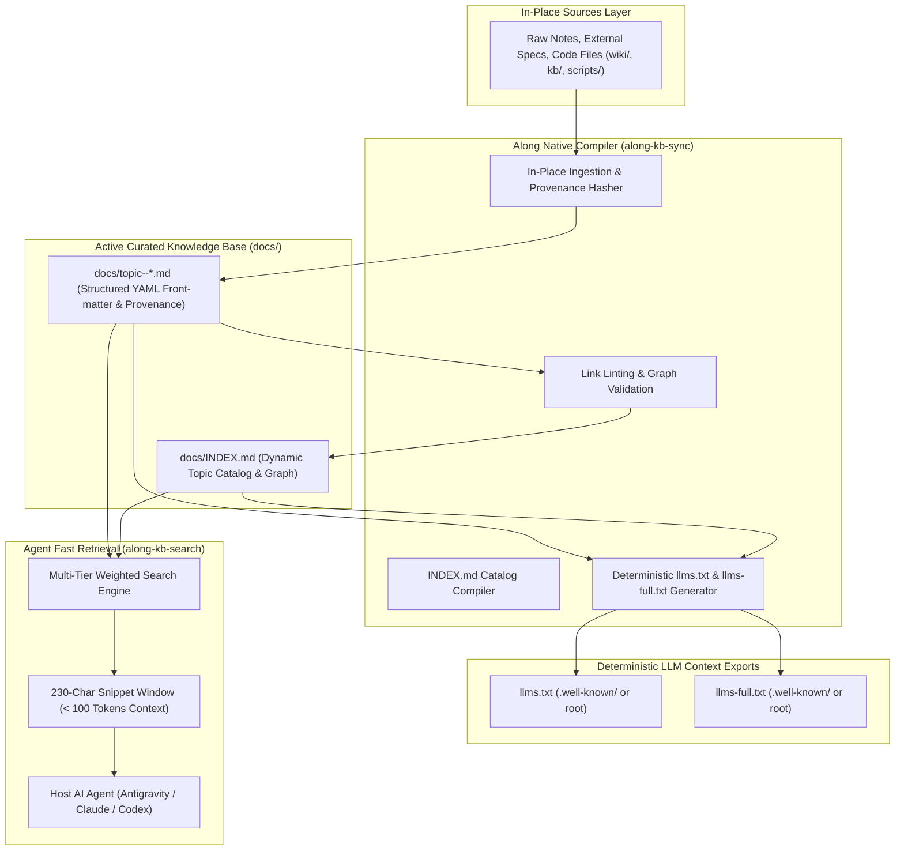

# LLM-Wiki Knowledge Base Architecture & Paradigm

Along implements the **LLM-Wiki architectural paradigm** (originated by Andrej Karpathy) as a native, provider-agnostic knowledge management system for software repositories.

---

## 1. Why LLM-Wiki? (The Core Problem)

AI coding agents face two common failure modes when navigating repository documentation:

1. **Context Bloat & Prompt Saturation (Prompt Stuffing)**:
   - Reading whole multi-kilobyte documentation files into agent prompts consumes 10,000 to 30,000+ tokens per interaction.
   - This exhausts the context window, degrades model reasoning, and drives up inference costs.
2. **Opaque & Fragile External Vector DBs**:
   - Heavy external vector databases introduce opaque embeddings, complex C-extension dependencies, and lack human-editable Markdown transparency.

### The Solution: The Living LLM-Wiki
A structured, human-readable directory of interconnected Markdown files (`docs/topic--*.md`) with YAML front-matter, an auto-compiled catalog (`docs/INDEX.md`), in-place source provenance tracking, deterministic `llms.txt` and `llms-full.txt` context compilers, and an ultra-fast, local snippet search engine (`along-kb-search`).

---

## 2. LLM-Wiki Architecture & Data Flow



---

## 3. Fast Retrieval Mechanics & Token-Based IDF Scoring

Instead of loading whole articles, AI agents query `along-kb-search "<query>"` to retrieve concise context snippets in milliseconds.

### Token-Based Weighted Scoring & IDF Algorithm
The search engine ranks results using word-boundary token matching, lightweight English stemming, and smoothed Inverse Document Frequency (IDF):

| Match Scope | Base Weight | Rationale |
| :--- | :--- | :--- |
| **Quoted Phrase** | **+30 title / +20 slug / +15 body** | Exact adjacent multi-word sequence match. |
| **Title Match** | **+15.0 * IDF** | Direct topic match indicating the exact domain article. |
| **Slug Match** | **+12.0 * IDF** | Exact architectural identifier match. |
| **Tags Match** | **+10.0 * IDF** | Curated metadata keywords matching the conceptual domain. |
| **Body Content** | **min(TF * IDF, 25.0)** | Frequency-saturated body occurrences scaled by discriminative rarity. |
| **Active Entity Boost** | **+2.0 points** | Boost for active, open, or in-progress issues and ADRs. |

### Snippet Window Extraction (Measured 95-99% Token Reduction)
When a match is identified, `along-kb-search` extracts a targeted word-boundary aligned passage centered around the matching query terms.
- *Prompt Impact*: Delivers the precise architectural constraint or API contract in **under 100 tokens**, compared to thousands of tokens for loading full files.
- *Verifiable Metrics*: Run with `--stats` to inspect live corpus size, returned token counts, and token savings percentage.
- *Performance*: Sub-100ms execution across hundreds of documents using pure standard library in-memory tokenization without database locking risks or vector embeddings latency.

---

## 4. In-Place Source Grounding, Provenance & Drift Gate

Along enforces in-place provenance for all synthesized Knowledge Base articles:

1. **In-Place Source Preservation**:
   - Raw sources, specifications, and reference notes remain in their original project locations (e.g. `wiki/`, `kb/`, `scripts/`). Files are NEVER moved into a hidden `.archive/` directory.
   - Every compiled article in `docs/topic--*.md` explicitly tracks its originating source files via the `sources: [{path, hash}]` YAML front-matter list.
2. **SHA-256 Drift Detection**:
   - The compiler computes normalized SHA-256 hashes of tracked sources during sync.
   - Running `python scripts/along_kb_sync.py --check` detects if underlying code or raw specifications have evolved, emitting `[DRIFT]` warnings that alert agents to review and reconcile documentation.
3. **Intent Gate for Content Reduction (`--prune-intent`)**:
   - To guard against accidental LLM deletions, `along-kb-sync` calculates net line-count reductions against Git `HEAD`.
   - In monorepos and nested subprojects, path queries use `HEAD:./<rel_path>` to ensure Git resolves paths relative to the subproject working directory rather than the repository root.
   - If an article shrinks by >25% in lines (and at least 10 lines), compilation halts with exit code 2 unless `--prune-intent [REASON]` is explicitly supplied.

---

## 5. Deterministic LLM Context Compilation: llms.txt & llms-full.txt

To provide external LLMs and IDE assistants with immediate context, `along-kb-sync` deterministically manages both index and full-context exports:

1. **Path Resolution & `.well-known/` Support**:
   - Resolves target files using `alongkit.repo.resolve_llm_targets(...)`.
   - Follows web standard precedence:
     - If `.well-known/llms.txt` exists, updates in `.well-known/`.
     - If root `llms.txt` exists, updates in root.
     - If both exist, synchronizes both to prevent drift.
     - If neither exists, creates in `.well-known/` if that directory exists, else defaults to repository root.
2. **Smart Non-Destructive `llms.txt`**:
   - Updates the `## Documentation Links` section to match active `docs/topic--*.md` articles.
   - Non-destructively preserves user-defined custom sections, descriptions, and external HTTP(S) references.
   - On initial creation, extracts project title and introductory summary from `README.md` (identifying the first H1 header and extracting the first valid blockquote or prose paragraph while ignoring GitHub alert callouts like `> [!NOTE]`, badges, and raw HTML).
3. **Pure Script Deterministic `llms-full.txt` Compilation**:
   - Zero LLM generation: compiled 100% deterministically by script.
   - Assembles `README.md`, `AGENTS.md`, and all `docs/topic--*.md` articles in sorted order.
   - Strips YAML front-matter and structures documents with clean Markdown section headers.
4. **Cascading Subproject Synchronization**:
   - Automatically walks downward to discover all subproject Along contexts and synchronizes their local `llms.txt` and `llms-full.txt` files whenever nested documentation exists.

---

## 6. Documentation Blast Radius & Code-Graph-to-Wiki Synchronization

In the LLM-Wiki paradigm, documentation is a living asset that evolves alongside code. Along enforces a **Deterministic 2-Phase Blast Radius Gate**:

```mermaid
flowchart LR
    DIFF["Code Modifications (git diff)"] --> CRG["code-review-graph (get_impact_radius_tool)"]
    CRG --> IMPACT["Impacted Symbols & Downstream Callers"]
    IMPACT --> SEARCH["along-kb-search (Topic Query)"]
    SEARCH --> TOPICS["Targeted docs/topic--*.md Files"]
    TOPICS --> EDIT["Factual Article Updates"]
    EDIT --> KBSYNC["along-kb-sync --strict (Integrity Gate)"]
    KBSYNC --> INDEX["docs/INDEX.md & Verified Links"]
```



1. **AST Blast Radius Discovery**: During task review, agents invoke `code-review-graph` MCP tools (`get_impact_radius_tool`, `get_affected_flows_tool`) to identify modified symbols and dependent modules.
2. **Topic Mapping**: Agents query `along-kb-search` with the modified symbol names to pinpoint the exact `docs/topic--*.md` files documenting those interfaces.
3. **Factual Updating**: Agents update the affected topic articles with concrete code facts (zero placeholders).
4. **Compilation & Link Gate**: Running `python scripts/along_kb_sync.py --strict` validates relative links across the repository and recompiles `docs/INDEX.md`.

---

## 7. Deterministic Topic Dictionary, Auto-Crosslinking & AST Symbol Grounding

To guarantee factual precision and cross-reference coherence without human micro-management, Along equips `along-kb-sync` with three deterministic compiler mechanisms:

### Deterministic Topic Dictionary & Auto-Crosslinking
- **TopicDictionary Indexing**: The compiler automatically extracts title, slug, and tag permutations across all `docs/topic--*.md` files. Entries are sorted longest-first to prioritize specific domain aliases (e.g. `LLM-Wiki Architecture` before `Architecture`).
- **Bounded Cross-Link Replacement**:
  - `scan_crosslinks()` and `apply_crosslinks()` audit prose for unlinked concept opportunities.
  - Skips Markdown headings (`#`, `##`), fenced code blocks (` ``` `), inline code spans (`` `...` ``), and existing relative/absolute links.
  - Enforces the **First Occurrence Per Section Rule**: only the first unlinked mention within any H2 section (`## `) is converted to a link (`[Term](./topic--slug.md)`).
  - Self-linking to the current article is strictly excluded.
  - Idempotent: re-running `--crosslink-apply` yields zero modifications.
- **CLI Options**:
  - `along kb-sync --crosslink-check`: Audits documentation for unlinked topic opportunities without modifying files.
  - `along kb-sync --crosslink-apply`: Applies deterministic cross-links in-place.

### AST Code Symbol Grounding Gate
- **AST Symbol Extraction**: Parses Python source files across `scripts/`, `dashboard/`, `tests/`, and `.along/scripts/` using Python's native `ast` module. Discovers classes, functions, async functions, methods, and uppercase module-level constants.
- **Ghost Symbol Detection (`--check-symbols`)**:
  - Inspects backticked spans (`` `symbol` ``) across all `docs/topic--*.md` articles.
  - Identifies identifier signatures (snake_case, PascalCase, UPPER_SNAKE, dotted member accesses) and checks them against the AST symbol inventory.
  - Flags ungrounded "ghost symbols" (non-existent classes, phantom functions, obsolete identifiers) that hallucinate codebase capabilities.
  - Builtin filter whitelists Python keywords, standard library modules/attributes (`sys.path`, `os.remove`), Win32 platform APIs, Dynstruct framework symbols, and MCP tools.
  - Exits with non-zero status in strict mode (`--check-symbols --strict`) when ghost symbols exist.

### Structured Section Taxonomy Contracts
- **Standard Article Schemas**: Core documentation types must satisfy required section structures defined in `SECTION_CONTRACTS`:
  - `architecture`: System Topology & Overview, Core Components & Engine Implementation, Data Flow & Execution Workflow, Invariants & Failure Modes.
  - `domain-model`: Entity Taxonomy & Ecosystem, Front-matter Schemas & Metadata, Graph Invariance & Relationships.
  - `setup-workflow`: Prerequisites & Installation, Runner Commands & Lifecycle Scripts, Quality Gates & Verification.
- **Fuzzy Heading & Non-Empty Body Verification**:
  - Matches headings with flexible regex pattern sets (supporting numbered variants such as `## 1. System Topology & Architecture`).
  - Requires each mandatory section to contain substantive documentation lines (preventing empty header stubs).
- **Enforcement**:
  - Automatically audited and logged as `[WARN]` during sync.
  - Strictly enforced via `along kb-sync --strict-sections`, exiting with code 1 on violations.

---

## 8. References & Useful Links

- **Andrej Karpathy's LLM-Wiki Concept**: Conceptual foundation for repository-native, human-readable structured LLM documentation.
- **[System Architecture & Flow](./topic--architecture.md)**: System topology, multi-branch concurrency, and multi-agent state machine.
- **[Domain Model & Entity Ecosystem](./topic--domain-model.md)**: Taxonomy of issues, milestones, ADRs, and living memory.
- **[Skills & Slash Commands Reference](./topic--skills-reference.md)**: Technical breakdown of all 18 automation skills.
- **[Setup & Developer Workflow](./topic--setup-and-workflow.md)**: Installation, runner hooks, and day-in-the-life development flow.
