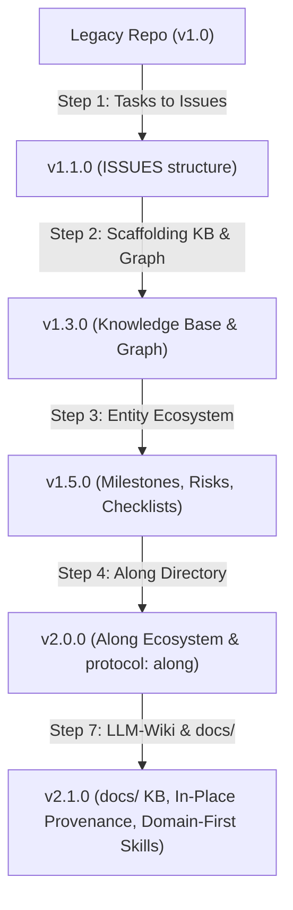

# Protocol & Repository Migrations Guide

This guide documents the versioned migration pipeline for the `ALONG-PROTOCOL` (`.along/`).

---

## 1. Overview & Execution Engine

The migration engine (`scripts/migrate_protocol.py`) inspects the target repository's
current structure and executes sequential migration steps to bring it up to the latest
standard. It is invoked by `/along-init` and `/along-update`, and by hand:

```bash
python scripts/migrate_protocol.py <target_root> --dry-run   # print the plan, write nothing
python scripts/migrate_protocol.py <target_root> --apply     # perform it
python scripts/migrate_protocol.py <target_root> --apply --force   # ignore the recorded state
```

Installing does not migrate. `install.ps1` / `install.sh` print how to run the engine and
do nothing to the repository unless given `-Migrate` / `--migrate`.



---

## 2. What the Engine Is Allowed To Do

The engine used to move legacy content by deleting whatever occupied the destination
(`os.remove(dst)` followed by `shutil.move`). A repository holding both a legacy
`.agents/` and an already-started `.along/` - a partial migration, or two branches
migrating separately - therefore lost the newer `DECISIONS.md` and `HISTORY.md`, which
are append-only by protocol and so irrecoverable. Four rules now hold, each with a
behavioral test in `tests/test_migration.py`:

1. **A destination file is never deleted.** What happens on a collision depends on the
   file class, and every outcome keeps both bodies:

   | Destination | Policy | Result |
   | :--- | :--- | :--- |
   | `DECISIONS.md`, `HISTORY.md` | Union merge | Entries the legacy copy has and the destination lacks are appended, deduplicated. This is what `.gitattributes` already does across branches (`merge=union`). |
   | `ISSUES.md`, `INDEX.md`, `DASHBOARD.md`, `dashboard.html` | Keep destination | Derived projections carry nothing their sources do not. The legacy copy is dropped; recompile with `/along-issue-sync` or `/along-kb-sync`. |
   | Entity files, anything else | Keep destination | The legacy copy is preserved as `<name>.legacy.md` beside it and reported as a resolved collision. |

2. **Dry run is the default for anything but a human at a terminal.** A caller that is
   not attached to a TTY gets the plan and a notice; mutation requires `--apply`. The two
   ways this engine used to run - from the installer and from the test suite - were both
   invocations nobody had asked for.
3. **A backup precedes the first change.** `.along/` and `.agents/` are copied to
   `.along/.migration-backup/<timestamp>/` before anything is modified, and the path is
   printed. The backup directory ignores itself via its own `.gitignore`, so it never
   reaches history and never edits the user's.
4. **Undecodable files are skipped and reported.** Markdown was read with
   `errors="ignore"` and written back, which deleted every byte that was not valid UTF-8.
   Reads are strict; a file that fails to decode is listed in the report and left alone.

`.along/.protocol-version` records the version the repository was last migrated to, so a
second run reports `already at v<version>; nothing to do` instead of re-executing eight
steps whose idempotency held only by accident. `--force` overrides it.

Every operation is recorded, so both modes end with the same report: the operations
grouped by kind, the collisions and how each was resolved, the skipped files, and the
backup path. All of it is implemented once, in `scripts/alongkit/migration.py`; a test
fails if the engine calls `shutil.move`, `os.remove` or their neighbours directly.

---

## 3. Version Migration Steps

### `v1.0.0` -> `v1.1.0`: Tasks to Issues
- Renames `TASKS.md` -> `ISSUES.md` and `TASKS/` -> `ISSUES/`.
- Enforces kebab-case `<type>--<slug>.md` naming for all issue files.

### `v1.1.0` -> `v1.3.0`: Knowledge Base & Code Graph
- Scaffolds initial Knowledge Base (`INDEX.md`, `topic--architecture.md`, `topic--domain-model.md`, `topic--setup-and-workflow.md`).
- Creates `.code-review-graph-ignore` with standard excludes (`node_modules/`, `dist/`, `build/`, `SESSIONS/`).

### `v1.3.0` -> `v1.5.0`: Entity Ecosystem & Retro-Synthesis
- Scaffolds `.along/MILESTONES/`, `.along/RISKS/`, `.along/SPIKES/`, `.along/CHECKLISTS/`, and `.along/ISSUES/done/`.
- Retroactively synthesizes completed milestones from Git history and session logs.
- Sanitizes non-ASCII typography (replacing em-dashes with standard ASCII hyphens).

### `v1.5.0` -> `v2.0.0`: Along Rebranding & Isolated `.along/`
- Migrates `.agents/` to `.along/` and updates `protocol: along` YAML front-matter across all entities.
- Validates entity relationships (`blocked_by`, `related`, `parent`) and verifies zero DAG cycles.

### `v2.0.0` -> `v2.1.0`: LLM-Wiki Architecture & Singular Domain-First Skills
- Migrates active Knowledge Base articles from `.along/KB/` to top-level `docs/`.
- Preserves raw, unmanaged source notes in-place with SHA-256 provenance tracking.
- Standardizes all 3-part skills to Singular Domain-First format (`along-<entity>-<action>`).
- Enforces mandatory `along-kb-search` agent querying rule to minimize token usage.
