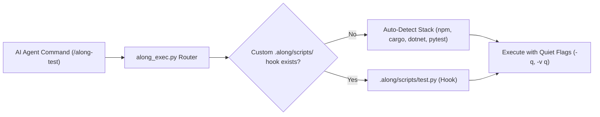
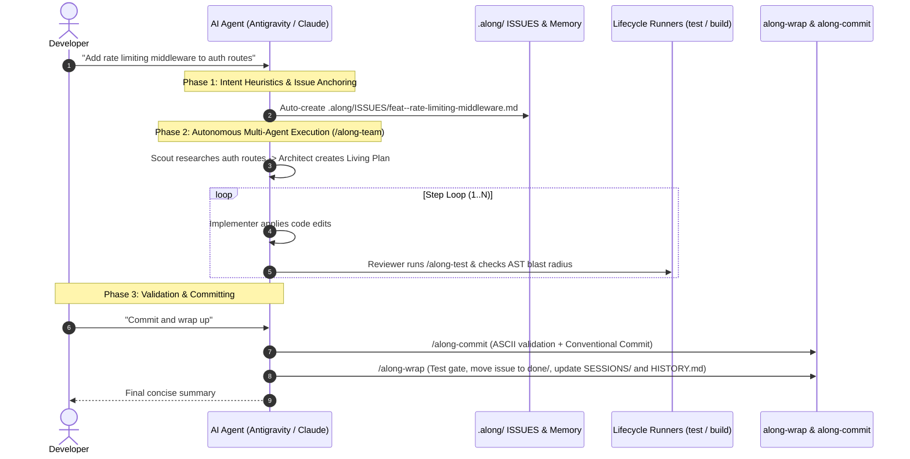

# Setup & Developer Workflow

Complete guide for installing Along, configuring repository lifecycle runners, and executing day-to-day development workflows across host AI agent runtimes.

---

## 1. Installation & Multi-Platform Setup

Along installs globally and configures provider-agnostic agent discoverability across Claude Code, OpenAI Codex, OpenCode, and Google Antigravity.

### Windows Installation
Run PowerShell as Administrator or with standard permissions:
```powershell
# Install for all supported agent runtimes (Claude, Codex, Antigravity, OpenCode)
powershell -NoProfile -ExecutionPolicy Bypass -File install.ps1 -Target all

# Or run the batch installer, which forwards its arguments to install.ps1
install.bat -Target all
```

### Linux / macOS Installation
```bash
# Make installer executable and run
chmod +x install.sh
./install.sh --target=all
```

### Supported Installation Targets
- `-Target all`: Deploys skills to `~/.claude/skills/`, `~/.codex/skills/`, `~/.gemini/config/skills/`, and `~/.config/opencode/commands/`.
- `-Target claude`: Deploys only to Claude Code.
- `-Target codex`: Deploys only to OpenAI Codex.
- `-Target antigravity`: Deploys only to Google Antigravity.
- `-Target opencode`: Deploys only to OpenCode.

### What an Install Writes

| Artifact | Destination | Notes |
| :--- | :--- | :--- |
| Skill folders (`skills/along-*`) | `<provider home>/skills/` | Copied, or linked with `-Symlink` / `--symlink`. |
| Language & platform rule packs (`rules/`) | `<provider home>/rules/` | Copied over the destination, never replacing the directory. |
| Engines and `alongkit/` | `~/.along/bin/` | The shared package travels with the engines. |
| OpenCode commands | `~/.config/opencode/commands/along-*.md` | Generated from the same `SKILL.md` bodies. |
| Default configuration | `~/.along/config.json` | Seeded only when absent; yours afterwards. |
| Install manifest | `~/.along/install-manifest.json` | Version, target homes, and every file the install wrote. |

Both installers write exactly the same artifact set; `tests/test_installers.py` runs each
one against a throwaway checkout and compares the result to the single layout description
in `alongkit.install.planned_files`.

Every root is overridable, which is how the tests run a real installer without touching
your own home: `--along-home=DIR --claude-home=DIR --codex-home=DIR --opencode-home=DIR
--antigravity-home=DIR` (`-AlongHome DIR`, `-ClaudeHome DIR`, ... in PowerShell).

### Removing an Install

```bash
./install.sh --uninstall
powershell -NoProfile -ExecutionPolicy Bypass -File install.ps1 -Uninstall
```

The uninstall removes exactly the files listed in `~/.along/install-manifest.json` and
nothing else: rules you wrote yourself, `~/.along/config.json`, and any provider
configuration stay. The same manifest is what lets a re-install remove a file Along used
to ship without deleting the directory that holds it. See
[ADR-2026-09-01--installers-never-delete-what-they-did-not-write](./decisions/ADR-2026-09-01--installers-never-delete-what-they-did-not-write.md).

### MCP Registration Honesty

The installers register the `code-review-graph` MCP server only where the provider's
configuration contract is verified. Today that is Claude Code, in the `mcpServers` map of
`~/.claude.json`. Codex (`~/.codex/config.toml`), OpenCode (`opencode.json`) and
Antigravity (the Gemini settings file) are reported with their path and the exact snippet
to add by hand, and are written only when you pass `--include-unverified-mcp`
(`-IncludeUnverifiedMcp`). Earlier versions wrote a `mcp_config.json` into four provider
homes, which no provider reads, and printed a success line for each; if you have those
files, they are inert and can be deleted.

A configuration file that does not parse is reported and left untouched, never replaced.

### Windows Git Concurrency & Index Handling

When running rapid AI coding agents (such as Google Antigravity, Claude Code, or Codex) on Windows, tools generate multiple file modifications in quick succession (< 500ms).

#### The Problem on Windows NTFS
By default, Git commands attempt to replace `.git/index` by writing to `.git/index.lock` and atomically replacing `.git/index` via Windows `ReplaceFileW`. If another process (such as Windows Defender, Search Indexer, or an IDE file watcher) has `.git/index` open for reading, NTFS sharing constraints cause `ReplaceFileW` to fail or get interrupted, leaving `.git/index` truncated to 0 bytes:
```text
fatal: .git/index: index file smaller than expected
```

#### Safe Mitigations
1. **Exclude `.git` from Antivirus and Search Indexing**:
   Add the repository root or `.git` directory to Windows Defender and Windows Search exclusion lists. Background file scanners are the primary source of file locking collisions during Git atomic replacements on NTFS.

2. **Self-Healing Index Recovery**:
   If `.git/index` becomes corrupted or truncated to 0 bytes due to an external lock collision, Along automatically executes index self-healing via `git read-tree HEAD` or `git reset` to restore the index without data loss.

3. **Avoid Disabling Stat-Cache Flags**:
   Do not set `GIT_OPTIONAL_LOCKS=0` or `diff.autoRefreshIndex false`. While intended to prevent lock contention during read operations, these flags disable Git stat-cache refresh on Windows, causing clean files to be falsely reported as modified (`" M"`) whenever file timestamps change.

#### Line Ending Normalization & `.gitattributes`
To eliminate conversion warnings and CRLF/LF diff noise on Windows:
1. **Repository-Managed Line Endings**:
   `.gitattributes` defines exact line endings per file class: `eol=lf` for Markdown, Python, JSON, YAML, Shell, and text files; `eol=crlf` strictly for `.ps1` and `.bat`.
2. **Recommended Git Configuration**:
   Set `git config core.autocrlf false` in the repository so Git relies strictly on `.gitattributes` rather than performing unprompted system-wide CRLF conversions.
3. **Working Tree Normalization**:
   If cloning onto a Windows environment with pre-existing CRLF drift, renormalize via:
   ```bash
   git add --renormalize .
   ```

---

## 2. Python Runtime & Dependencies

The engines behind the skills need one third-party package, `ruamel.yaml`, to read and
write entity front-matter. Everything else is standard library.

```bash
# Recommended: install the toolchain with uv (creates an isolated environment)
uv tool install actdim-along

# Working inside this repository: uv resolves the environment from pyproject.toml
uv run python -m unittest discover tests -q

# No uv, no install: add the dependency to the active interpreter
python -m pip install "ruamel.yaml>=0.18"
```

An engine invoked directly as `python scripts/along_exec.py ...` or
`python ~/.along/bin/along_exec.py ...` checks for the dependency itself: if it is missing
and `uv` is on `PATH`, the engine re-executes once under `uv run` and continues. If `uv` is
absent it exits with code 2 and the two commands above, rather than a traceback.

Why a dependency at all: front-matter is YAML because tools that are not Along read it, and
a hand-rolled parser silently dropped block sequences and emitted blocks that no strict YAML
reader accepts. See [ADR-2026-09-01--frontmatter-on-ruamel-yaml](./decisions/ADR-2026-09-01--frontmatter-on-ruamel-yaml.md).

The dashboard (`/along-dash`) additionally needs FastAPI, Uvicorn, Pydantic, and Rich,
declared as the `dash` extra and resolved automatically by `uv run scripts/along_dash.py`.

---
## 3. Bootstrapping a New or Existing Repository

To initialize Along in any repository:
```bash
# Inside the repository root, run:
along-init
```
*(Or invoke `/along-init` directly inside your AI agent prompt).*

### What `along-init` Configures:
1. `AGENTS.md`: Generates the root protocol context with the managed `ALONG-PROTOCOL v2.6.0` block.
2. `CLAUDE.md`: Scaffolds the standard `@AGENTS.md` import line.
3. `.gitattributes`: Configures `merge=union` for `.along/HISTORY.md` and `.along/DECISIONS.md` to prevent merge collisions across branches.
4. `.along/`: Creates the persistent repository memory skeleton (`ISSUES/`, `DECISIONS.md`, `MILESTONES/`, `RISKS/`, `SPIKES/`, `CHECKLISTS/`, `SESSIONS/`, `docs/`).

---

## 4. Repository Lifecycle Runners (`.along/scripts/`)

Along establishes a unified interface for project lifecycle operations via `.along/scripts/`. This allows AI agents to build, test, run, and bump versions across any technology stack without requiring custom prompt tuning.



### Standard Lifecycle Commands:

| Command | Canonical Script | Fallback Stack Auto-Detection | Purpose |
| :--- | :--- | :--- | :--- |
| `/along-build` | `.along/scripts/build.py` | `npm run build` \| `cargo build` \| `dotnet build` \| `python -m build` | Compiles source artifacts. |
| `/along-test` | `.along/scripts/test.py` | `pytest -q` \| `npm test` \| `cargo test -q` \| `dotnet test -v q` | Executes unit tests with quiet flags. |
| `/along-dev` | `.along/scripts/dev.py` | `npm run dev` \| `cargo run` \| `dotnet run` \| `python main.py` | Starts local development server. |
| `/along-version-bump` | `.along/scripts/bump_version.py` | Node `package.json` \| Python `pyproject.toml` \| Rust `Cargo.toml` \| .NET `*.csproj` | Bumps version and orchestrates release. |
| `/along-dep-scan` | `.along/scripts/dep_scan.py` | Node `package.json` \| Python `pyproject.toml` \| Rust `Cargo.toml` \| .NET `*.csproj` \| Go `go.mod` | Discovers dependencies and AI instruction rules. |

### Polyglot Hook Selection & Security

Lifecycle hooks are not limited to Python. Along detects the file extension and selects the appropriate interpreter:

| Extension | Runtime / Interpreter | Invocation Pattern |
| :--- | :--- | :--- |
| `.py` | Current Python runtime | `[sys.executable, script_path, *args]` |
| `.sh` | Bash shell | `[bash, script_path, *args]` |
| `.ps1` | PowerShell Core / Desktop | `[pwsh, -NoProfile, -File, script_path, *args]` |
| `.bat`, `.cmd` | Windows Command Processor | `[cmd.exe, /c, script_path, *args]` |
| (binary) | Direct executable | `[script_path, *args]` |

Every invocation enforces `shell=False` and passes command arguments as pre-split lists (`argv`). This guarantees that argument spaces, quotes, and shell metacharacters arrive in the child process without shell injection vulnerabilities.

### Zero-Config Auto-Synthesis & Status Tags

When an AI agent runs `/along-test` or `/along-build` in a repository that lacks `.along/scripts/`:
1. Along scans repository manifests to identify the active ecosystem (Node.js, Rust, .NET, Python, Go).
2. If recognized, Along synthesizes a verified hook file (e.g. `.along/scripts/test.py`) with quiet flags (`-q`, `--silent`) and writes a `# Status: verified` header tag.
3. If the ecosystem cannot be inferred, Along generates a safe template marked `# Status: unconfigured`, prompting the developer or agent to customize the command.

### Typography: checking and repairing

`along sanitize` (or `python scripts/sanitize_typography.py`) reports banned characters
by file and line. It **checks by default and writes nothing**; repairing is an explicit act.

| Invocation | Effect |
| :--- | :--- |
| `along sanitize` | Report findings, exit 1. Nothing is written. |
| `along sanitize --dry-run` | Report findings, exit 0. Nothing is written. |
| `along sanitize --write` | Apply the ASCII replacements. |
| `along sanitize --json` | The same report as JSON on stdout, for tooling and CI. |
| `along sanitize --include-data` | Also scan `.json`, `.yaml`, `.yml`, `.toml`. |
| `along sanitize --exclude '<glob>'` | Skip matching paths; `.alongsanitizeignore` in the repository root does the same, one glob per line. |

Scope is `.md`, `.py`, `.sh`, `.ps1`, `.bat`; hidden directories such as `.along/` are
included; localized resource directories (`locales/`, `i18n/`, `translations/`, ...) are
never scanned. A file that is not valid UTF-8 is skipped and reported, and existing line
endings are preserved, so a CRLF `.ps1` stays CRLF. See
[ADR-2026-09-01--typography-rule-scope](./decisions/ADR-2026-09-01--typography-rule-scope.md).

### Releasing: gates first, then a transaction

`/along-version-bump [patch|minor|major|<version>]` runs in a fixed order, and the order is
the point: the tests, the typography check, and the Markdown link check all run **before the
first byte is written**, on every invocation. A bump without `--commit` is verified exactly
as strictly as one with it.

| Step | What it writes |
| :--- | :--- |
| 1. Gates | Nothing. Tests, typography check, `along_kb_sync.py --check --strict`. |
| 2. Version | `.along/scripts/bump_version.py` if present, else the detected manifest (`package.json`, `pyproject.toml`, `Cargo.toml`, `VERSION`, or the Along protocol files). |
| 3. Milestone | Front-matter of the milestone in `.along/MILESTONES/` whose `slug` names the version: `status: completed`, `progress_pct: 100`. The body is never touched. |
| 4. CHANGELOG | A `## v<version>` section listing commit subjects since the previous tag. |
| 5. Commit and tag (`-c`) | Stages only the paths steps 2 to 4 wrote, commits `release: v<version>`, creates the annotated tag `v<version>`. `-p` pushes both. |

Steps 2 to 4 are transactional. A failure in any of them, or in staging, restores every file
byte for byte and prints what it put back; the transaction closes once the commit exists,
because past that point a rollback would discard committed work. `--fix-typography` opts
into repairing the findings from step 1 and is itself covered by the rollback. `-n` /
`--no-verify` is the one documented way past the gates.

A release writes nothing outside the repository. Installing skills for your providers is
`/along-update` or `install.ps1` / `install.sh`, run deliberately.

---

## 5. Day-in-the-Life Developer & Agent Workflow

The standard developer workflow in an Along-enabled repository flows through 6 phases:



### Step 1: Morning Sync & Task Triage
- Launch `/along-dash` to inspect sprint KPIs, active blockers in `.along/RISKS/`, and the entity DAG.
- Review active issues in `.along/ISSUES.md`.

### Step 2: Task Claiming & Intent Recognition
- Issue a natural language prompt to the agent (e.g. *"Fix Windows path escaping in CLI"*).
- The agent automatically infers the issue type (`bug`), creates `.along/ISSUES/bug--windows-path-escaping.md`, and sets `status: in-progress`.

### Step 3: Execution via `/along-team`
- For S-size tasks (1-2 files): The agent fast-paths edits directly and runs tests.
- For M/L/XL-size tasks: The agent activates the multi-agent sequential state machine, creating a dynamic Living Plan and verifying each step with an independent Reviewer subagent.

### Step 4: Verification & AST Blast Radius Gate
- Run `/along-test` to ensure zero regressions.
- Execute `/along-graph-check` to trace caller contracts and map affected symbols to `docs/topic--*.md` Knowledge Base articles.

### Step 5: Clean Conventional Commit
- Execute `/along-commit -i <slug> -m "<summary>"`.
- Verifies clean ASCII typography (no em-dashes, no curly quotes) and binds the commit to the active issue.
- The typography gate **reports and aborts**; it does not rewrite the working tree. Findings
  are printed with file and line. Add `--fix-typography` to apply the replacements in the
  same run, or clean them by hand.
- A file that is not valid UTF-8 is skipped and named, never decoded lossily and rewritten.
  See [ADR-2026-09-01--typography-rule-scope](./decisions/ADR-2026-09-01--typography-rule-scope.md).

### Step 6: Session Wrap-Up
- Invoke `/along-wrap` to execute the mandatory completion checklist:
  1. Automated test suite check.
  2. Documentation blast radius sync (`/along-kb-sync`).
  3. Move issue to `.along/ISSUES/done/`.
  4. Reconcile `ISSUES.md` projection.
  5. Record work session log in `.along/SESSIONS/<YYYY>/`.
  6. Append history line to `.along/HISTORY.md`.
  7. Purge ephemeral blackboard `.along/.session/<slug>/`.

---

## 6. Writing Tests: the Hermetic Rule

Agents write most of the tests in this repository, so the rule that keeps the suite
trustworthy is stated here as well as in the protocol block of `AGENTS.md`.

**A test must never point an engine at the repository that contains it.** The engines
write: `migrate_protocol.py` normalizes front-matter, sanitizes typography, and rewrites
Markdown links across the whole tree; `along_update.py` regenerates the managed protocol
block; `along_exec.py` creates and moves entities. Three tests used to pass `REPO_ROOT`
straight into those engines, and one of them rewrote a newly created issue file mid-session,
turning `protocol_version: "2.2.8"` into `protocol_version: 2.2.8`. A suite in that state
cannot act as a gate, because "the suite is green" and "the tree is clean" are no longer
simultaneously achievable, and CI cannot tell a real change from test noise.

### How to write one

```python
import hermetic          # tests/hermetic.py

def test_engine_does_the_thing(self):
    with hermetic.repo_fixture(prefix="along-mything-") as fixture:
        res = proc.run_capture([sys.executable, engine_script, fixture])
        self.assertEqual(res.returncode, 0, res.stderr)
```

`hermetic.repo_fixture()` builds a throwaway repository that looks like a current Along
project (`AGENTS.md` with the managed block, `.along/` with one valid entity, an ADR, the
board, and a small `docs/` Knowledge Base) and removes it afterwards. It is deliberately
not a git repository, so nothing a test runs can reach a real index or history. For an
engine that resolves its target from the working directory, such as `along_exec.py`, pass
the fixture as `cwd` instead of as an argument.

Reading live repository content is still allowed and several guards depend on it: the ADR
format guard in `tests/test_kb_search.py`, the entity-status guard in
`tests/test_issue_lifecycle.py`, and the typography and link gates. Those tests open files
read-only and never invoke an engine that writes.

### What enforces it

`tests/test_zz_hermetic_suite.py` runs last (alphabetically, under `unittest discover`) and
holds two gates:

| Gate | What it does |
| :--- | :--- |
| `test_01_working_tree_is_unchanged_by_the_suite` | Snapshots `git status --porcelain -u` at import time and again after the suite, failing on any path that appeared, vanished, or changed status. |
| `test_02_no_test_targets_the_repository_root` | Parses every `tests/*.py` and fails on a command-shaped list literal built with `REPO_ROOT` as an argument, so a regression is caught when it is written rather than when it happens to do damage. |

Run the suite with `python .along/scripts/test.py` (it resolves `ruamel.yaml` through `uv`
when the interpreter lacks it) or `uv run python -m unittest discover tests -q`.
