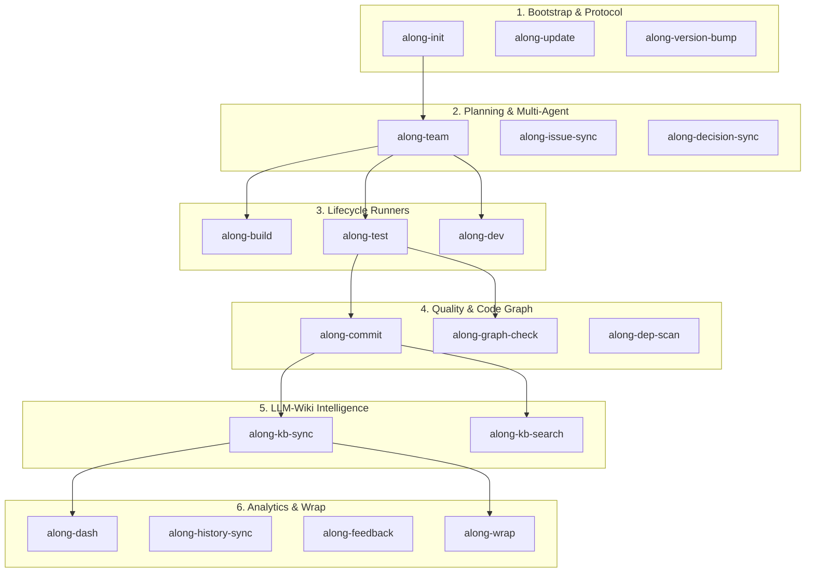

# Skills & Slash Commands Technical Reference

Along provides an integrated suite of **18 singular automation skills** operating across Claude Code, OpenAI Codex, OpenCode, and Google Antigravity.

Each skill is built on a domain-first naming pattern (`along-<entity>-<action>`), guarantees clean ASCII output, operates on strongly typed repository entities, and can be invoked either explicitly via slash commands/CLI or automatically via semantic intent recognition.

---

## Skills Ecosystem & Workflow Phases

---

## 1. Bootstrap & Repository Protocol Management

### `along-init`
- **What it is**: The foundation bootstrapping engine for Along in any repository. Scaffolds or refreshes root `AGENTS.md` (carrying the managed protocol block), `CLAUDE.md`, `.gitattributes` (with `merge=union`), and the `.along/` directory skeleton (`ISSUES/`, `DECISIONS.md`, `MILESTONES/`, `RISKS/`, `SPIKES/`, `CHECKLISTS/`, `SESSIONS/`, `docs/`).
- **Architectural Rationale**:
  - *Idempotent Managed Block*: Never overwrites custom human developer instructions in `AGENTS.md`; only refreshes the block between `<!-- BEGIN ALONG-PROTOCOL ... -->` and `<!-- END ALONG-PROTOCOL -->`.
  - *Non-Destructive Initialization*: Creates directories and template files only if missing, preserving existing project history.
- **Invocation Triggers**:
  - *Explicit*: `/along-init`, `install.ps1`, `install.sh`.
  - *Semantic / Automatic*: Triggered when an agent detects an uninitialized repository, missing `AGENTS.md`, or a user prompt like *"Set up Along in this repo"*, *"Initialize agent instructions"*.
- **Entities Operated On**: `AGENTS.md`, `CLAUDE.md`, `.gitattributes`, `.along/ISSUES/`, `.along/DECISIONS.md`, `docs/`.
- **Ecosystem Chaining**: Followed immediately by `/along-kb-sync` (to ingest `README.md`) and `/along-dep-scan`.

---

### `along-update`
- **What it is**: Automated protocol and skill synchronizer. Checks and pulls latest Along skills, migrations, and protocol definitions across user home directories (`~/.claude`, `~/.codex`, `~/.gemini`) and local repositories.
- **Architectural Rationale**:
  - Eliminates skill drift across multiple developer machines.
  - Automatically executes retroactive migration scripts (`scripts/migrate_protocol.py`) to upgrade legacy front-matter schemas and directory layouts without data loss.
- **Invocation Triggers**:
  - *Explicit*: `/along-update`, `along update` (fallback: `python ~/.along/bin/along_exec.py update`).
  - *Semantic / Automatic*: Triggered on protocol version mismatch, outdated skills warnings, or prompts like *"Upgrade Along protocol"*, *"Update agents"*.
- **Entities Operated On**: Global skill folders (`~/.gemini/config/skills/along-*`), target repository `AGENTS.md`, `scripts/`.
- **Ecosystem Chaining**: Runs `migrate_protocol.py` and triggers `/along-kb-sync --strict` to validate repository link integrity after updates.

---

### `along-version-bump`
- **What it is**: Universal multi-stack semantic version bumper and release orchestrator. Updates project versions across Node (`package.json`), Python (`pyproject.toml`), Rust (`Cargo.toml`), .NET (`*.csproj`), or Along protocol files.
- **Architectural Rationale**:
  - *Stack-Agnostic Hook Architecture*: Executes repository-specific hooks in `.along/scripts/bump_version.py` with automatic fallback to stack auto-detection.
  - *Pre-Release Quality Gate*: Runs the test suite, the typography check, and the Markdown link check BEFORE the first byte is written, on every invocation rather than only when `--commit` is passed. The typography step aborts on a finding rather than rewriting the tree; `--fix-typography` opts into the repair.
  - *Transactional Release*: Every mutation is recorded by `alongkit.transaction.FileTransaction`. A failure anywhere up to the git commit restores each file byte for byte and reports what it put back, so an aborted release leaves no half-released tree. The transaction closes once the commit exists.
  - *No Global Side Effects*: A version bump never reinstalls the machine's agent configuration. Installing globally is `/along-update` or the installer.
- **Invocation Triggers**:
  - *Explicit*: `/along-version-bump [patch|minor|major|<version>] [-c|--commit] [-p|--push] [--fix-typography] [-n|--no-verify]`, `along bump` (fallback: `python ~/.along/bin/along_exec.py bump`).
  - *Semantic / Automatic*: Triggered when preparing a release, completing a milestone sprint, or prompted with *"Release version 2.3.0"*, *"Bump patch version"*.
- **Entities Operated On**: `package.json`, `pyproject.toml`, `Cargo.toml`, `*.csproj`, `VERSION`, `AGENTS.md`, `CHANGELOG.md`, the milestone in `.along/MILESTONES/` whose front-matter `slug` names the released version.
- **Ecosystem Chaining**: Chains with `/along-test` for pre-release validation, `/along-kb-sync --check --strict` for the link gate, and creates the release commit plus the annotated `v<version>` tag itself.

---

## 2. Orchestration, Planning & Multi-Agent Teams

### `along-team`
- **What it is**: Sequential multi-agent development engine and living plan orchestrator. Replaces chaotic chat rooms with a deterministic state machine: `Supervisor -> Scout (Research) -> Architect (Living Plan) -> Step Loop [Implementer -> Reviewer/Tester -> Reassess] -> Wrap`.
- **Architectural Rationale**:
  - *Context Pruning Gatekeeping*: The Supervisor strips raw tool outputs from the Scout, injecting only distilled facts into the Implementer to prevent prompt saturation.
  - *Dual-Track UI & Memory Projections*: Projects the Living Plan and Walkthrough into native IDE visual design cards (`implementation_plan.md` with interactive "Proceed" feedback, and `walkthrough.md`) when running under Google Antigravity, while persisting portable Markdown on disk (`.along/.session/<slug>/`) across all CLI runtimes (Claude Code, OpenAI Codex, OpenCode).
  - *Loop Disambiguation (Fix Loop vs Re-plan Loop)*: Distinguishes local micro-iterations (`[Fix Loop]`: worker resolves test/lint errors within immediate diff, max 2 retries) from structural architectural revisions (`[Re-plan Loop]`: Architect increments living plan to `Revision N+1` on blockers or assumption changes).
  - *Engineering Provenance Compilation*: Captures the full trajectory (initial plan baseline, execution trace of fix and re-plan loops, and final gate verification manifest) and compiles it into the permanent session log in `.along/SESSIONS/`.
  - *Independent Gatekeeper Review*: Reviewer evaluates code in an isolated subagent context (or single-agent fallback) against the conditional 7-point verification rubric (file integrity, automated tests, diff scope, requirement traceability, AST blast radius, documentation parity, clean ASCII).
  - *Adaptive Complexity Routing*: Fast-paths S-size tasks (1-2 files) without subagents; uses full state machine only for M/L/XL tasks.
- **Invocation Triggers**:
  - *Explicit*: `/along-team <slug>`, `/goal <task>`.
  - *Semantic / Automatic*: Triggered automatically for multi-file feature requests, complex refactorings, or prompts like *"Implement this feature with the agent team"*.
- **Entities Operated On**: `.along/ISSUES/<type>--<slug>.md`, `.along/.session/<slug>/` (ephemeral blackboard: `living_plan.md`, `execution_trace.md`, `blackboard.md`), `docs/`.
- **Ecosystem Chaining**: Uses `along-build`, `along-test`, `along-graph-check` during step loops, and finishes via `along-wrap`.

---

### `along-issue-sync`
- **What it is**: Idempotent synchronization engine that reconciles atomic issue files (`.along/ISSUES/*.md`, `.along/ISSUES/done/*.md`) into the compact active issue board projection (`.along/ISSUES.md`).
- **Architectural Rationale**:
  - *Zero-Manual-Merge Principle*: Because `ISSUES.md` is a compiled projection, git merge conflicts are resolved automatically by running `along-issue-sync` rather than manually resolving diffs.
- **Invocation Triggers**:
  - *Explicit*: `/along-issue-sync`, `along issue sync` (fallback: `python ~/.along/bin/along_exec.py issue sync`).
  - *Semantic / Automatic*: Triggered during `/along-wrap`, when an issue changes status, or during post-git-merge reconciliation.
- **Entities Operated On**: `.along/ISSUES/*.md`, `.along/ISSUES/done/*.md`, `.along/ISSUES.md`.
- **Ecosystem Chaining**: Feeds data into `along-dash` and `along-wrap`.

---

### `along-decision-sync`
- **What it is**: Architectural Decision Record (ADR) recorder. Appends structured architectural decisions with decentralized slug headers (`## ADR-YYYY-MM-DD--<slug>`) into `.along/DECISIONS.md`.
- **Architectural Rationale**:
  - *Decentralized Slug Headers*: Prevents merge collisions across concurrent branches compared to sequential integer numbering (`#012`).
  - *Append-Only Invariance*: Old decisions are never deleted or rewritten; when superseded, they are marked `superseded by ADR-YYYY-MM-DD--<slug>`.
- **Invocation Triggers**:
  - *Explicit*: `/along-decision-sync`, `along decision create` (fallback: `python ~/.along/bin/along_exec.py decision create`).
  - *Semantic / Automatic*: Triggered whenever a non-trivial architectural choice, library selection, or database schema design is confirmed during a session or spike.
- **Entities Operated On**: `.along/DECISIONS.md`.
- **Ecosystem Chaining**: Governs Reviewer checks in `along-team` and informs documentation updates in `along-kb-sync`.

---

## 3. Development & Lifecycle Execution Runners

### `along-build`
- **What it is**: Universal build runner. Executes repository build lifecycle via `.along/scripts/build.py` (or `.sh`, `.ps1`, `.bat`) with fallback to auto-detected package runners (`npm run build`, `cargo build`, `dotnet build`, `python -m build`). Custom project hooks in `.along/scripts/` take absolute precedence.
- **Architectural Rationale**:
  - *Non-Destructive Standardized Interface*: AI agents execute a single unified command (`along-build`) across any programming language or technology stack without needing custom per-repo prompt tuning.
- **Invocation Triggers**:
  - *Explicit*: `/along-build`, `along build` (fallback: `python ~/.along/bin/along_exec.py build`).
  - *Semantic / Automatic*: Triggered after code edits, before pre-commit checks, or when the user prompts *"Build the project"*.
- **Entities Operated On**: `.along/scripts/build.py` (and `.sh`, `.ps1`, `.bat`), build output targets (`dist/`, `build/`, `bin/`).
- **Ecosystem Chaining**: Prerequisite for `along-test` and `along-dash` UI builds.

---

### `along-test`
- **What it is**: Universal automated test runner with quiet flags (`pytest -q`, `npm test`, `cargo test -q`, `dotnet test -v q`). Executes `.along/scripts/test.py` (or `.sh`, `.ps1`, `.bat`) with custom hooks taking absolute precedence over auto-detection.
- **Architectural Rationale**:
  - *Token Hygiene via Quiet Flags*: Suppresses massive verbose test logs in agent prompts, emitting clean summary counts (pass/fail) to conserve context budget.
- **Invocation Triggers**:
  - *Explicit*: `/along-test`, `along test` (fallback: `python ~/.along/bin/along_exec.py test`).
  - *Semantic / Automatic*: Triggered during every Reviewer step in `along-team`, before pre-commit in `along-commit`, and during `/along-wrap`.
- **Entities Operated On**: `.along/scripts/test.py` (and `.sh`, `.ps1`, `.bat`), test suites (`tests/`, `src/**/*.test.ts`).
- **Ecosystem Chaining**: Core quality gate for `along-team`, `along-commit`, and `along-version-bump`.

---

### `along-dev`
- **What it is**: Development server runner. Launches local dev servers or debug runners via `.along/scripts/dev.py` (or `.sh`, `.ps1`, `.bat`) or auto-detected runners (`npm run dev`, `cargo run`, `dotnet run`, `python main.py`).
- **Architectural Rationale**:
  - Provides a single standardized hook (`.along/scripts/dev.py`) for background daemon execution.
- **Invocation Triggers**:
  - *Explicit*: `/along-dev`, `along dev` (fallback: `python ~/.along/bin/along_exec.py dev`).
  - *Semantic / Automatic*: Triggered when the user requests *"Start local dev server"*, *"Run application locally"*.
- **Entities Operated On**: `.along/scripts/dev.py` (and `.sh`, `.ps1`, `.bat`).
- **Ecosystem Chaining**: Pairs with `along-dash` for local interactive debugging.

---

## 4. Quality Gates, Code Graph & Commit Integrity

### `along-commit`
- **What it is**: Smart, ASCII-clean Conventional Committer. Validates typography, binds commit messages to active `.along/` issues, and creates clean Git commits.
- **Architectural Rationale**:
  - *Typography & Non-ASCII Gate*: Scans repository text to block forbidden typographic characters (em-dash, smart curly quotes, non-breaking spaces, byte order marks) that corrupt Windows shell execution or AST parsers. It reports findings by file and line and aborts; it does not rewrite the tree unless `--fix-typography` is passed, and it never rewrites a file that is not valid UTF-8. See [ADR-2026-09-01--typography-rule-scope](../.along/DECISIONS.md).
  - *Issue Traceability*: Enforces issue slug references (`(refs #<slug>)` or `[<slug>]`) for 100% auditability.
- **Invocation Triggers**:
  - *Explicit*: `/along-commit -i <slug> -m "<message>" [--fix-typography]`, `along commit` (fallback: `python ~/.along/bin/along_exec.py commit`).
  - *Semantic / Automatic*: Triggered when completing a task or when prompted with *"Commit changes"*.
- **Entities Operated On**: Git staging index, `.along/ISSUES/`, active commit logs.
- **Ecosystem Chaining**: Precedes `/along-wrap`.

---

### `along-graph-check`
- **What it is**: AST call graph and blast radius inspection engine. Uses `code-review-graph` MCP tools to map impacted functions, downstream callers, and interface breaks.
- **Architectural Rationale**:
  - *Deterministic Blast Radius*: Prevents silent regression bugs by identifying all dependent callers across the codebase before code is merged.
  - *Graph-Ignore Filtering*: Enforces `.code-review-graph-ignore` to exclude `node_modules` and vendor directories, preventing graph database ballooning.
- **Invocation Triggers**:
  - *Explicit*: `/along-graph-check`, `along graph-check` (fallback: `python ~/.along/bin/along_exec.py graph-check`).
  - *Semantic / Automatic*: Triggered during Phase 4 (Reviewer) in `along-team` and before session wrap-up for non-trivial refactorings.
- **Entities Operated On**: `.code-review-graph-ignore`, AST symbol database.
- **Ecosystem Chaining**: Maps identified AST symbols directly into `along-kb-search` for Knowledge Base synchronization.

---

### `along-dep-scan`
- **What it is**: Hierarchical multi-project and submodule dependency scanner. Scans package manifests (`package.json`, `pyproject.toml`, `Cargo.toml`, `*.csproj`), custom hooks (`.along/scripts/dep_scan.py`), submodules, and symlinks for declared AI instructions and vendor rules.
- **Architectural Rationale**:
  - Extracts subproject constraints, custom ecosystem hooks, and vendor AI rules into `docs/topic--dependencies.md`, giving agents unified visibility into third-party constraints without manual file hunting.
- **Invocation Triggers**:
  - *Explicit*: `/along-dep-scan`, `along dep-scan` (fallback: `python ~/.along/bin/along_exec.py dep-scan`).
  - *Semantic / Automatic*: Triggered during `/along-init`, after dependency updates, or when adding a new Git submodule.
- **Entities Operated On**: `package.json`, `pyproject.toml`, `Cargo.toml`, `*.csproj`, `.along/scripts/dep_scan.py`, `docs/topic--dependencies.md`.
- **Ecosystem Chaining**: Feeds architectural constraints into `docs/topic--dependencies.md` and `along-kb-sync`.

---

## 5. Knowledge Base & LLM-Wiki Intelligence

### `along-kb-sync`
- **What it is**: Idempotent LLM-Wiki compiler, inbound link rewriter, and link integrity gate for `docs/`.
- **Architectural Rationale**:
  - *LLM-Wiki Paradigm*: Implements Andrej Karpathy's LLM-Wiki architecture in Python with a single runtime dependency (`ruamel.yaml`, for front-matter), resolved automatically by `uv`.
  - *Inbound Link Rewriter*: Recursively scans Markdown files and safely rewrites legacy internal paths (`.along/KB/...`, `.agents/KB/...`) to standard relative `docs/` paths only when target exists on disk, skipping code fences and unrelated numbered docs unless opted in.
  - *Link Integrity Gate*: In `--strict` mode, validates that every relative Markdown link physically resolves to an existing file on disk.
  - *In-Place Source Provenance & Drift Gate*: Reconciles raw notes, code, and specs in-place with `sources: [{path, hash}]` front-matter tracking, detecting drift via SHA-256 and guarding accidental reductions via the `--prune-intent` gate.
  - *Deterministic LLM Context Exports*: Non-destructively reconciles `llms.txt` and compiles `llms-full.txt` across `.well-known/` and context root locations for whole-project and subproject contexts.
- **Invocation Triggers**:
  - *Explicit*: `/along-kb-sync [--strict] [--prune-intent [REASON]] [--dry-run] [--migrate-numbered]`, `along kb-sync` (fallback: `python ~/.along/bin/along_exec.py kb-sync`).
  - *Semantic / Automatic*: Triggered during `/along-wrap`, after modifying documentation in `docs/`, or during protocol migration.
- **Entities Operated On**: `docs/*.md`, `docs/INDEX.md`, `llms.txt`, `llms-full.txt`, `.well-known/`, all repository Markdown files.
- **Ecosystem Chaining**: Compiles the Knowledge Base queried by `along-kb-search` and visualized by `along-dash`.

---

### `along-kb-search`
- **What it is**: Ultra-fast, token-efficient multi-scope search engine across Knowledge Base (`docs/`) and living project memory (`ISSUES/`, `DECISIONS.md`, `MILESTONES/`, `RISKS/`, `SESSIONS/`).
- **Architectural Rationale**:
  - *Measured 95-99% Token Reduction*: Instead of reading whole multi-kilobyte documents into prompt context, retrieves concise word-boundary aligned snippet windows in under 100 tokens, verifiable via `--stats`.
  - *Multi-Tier Relevance Scoring & IDF Weighting*: Ranks results using word-boundary token matching, lightweight stemming, smoothed inverse document frequency (IDF), and exact phrase matching with AND semantics by default (`--any` for OR).
- **Invocation Triggers**:
  - *Explicit*: `/along-kb-search "<query>" [--category <cat>] [--any] [--prefix] [--stats]`, `along kb-search` (fallback: `python ~/.along/bin/along_exec.py kb-search`).
  - *Semantic / Automatic*: Mandatory first step for agents when researching domain architecture, investigating existing decisions, or mapping blast radius.
- **Entities Operated On**: `docs/`, `.along/ISSUES/`, `.along/DECISIONS.md`, `.along/MILESTONES/`, `.along/RISKS/`, `.along/SPIKES/`, `.along/SESSIONS/`.
- **Ecosystem Chaining**: Used by Scout and Supervisor in `along-team` during Phase 1 (Research).

---

## 6. Visual Analytics, History & Diagnostics

### `along-dash`
- **What it is**: Multi-mode executive dashboard and interactive Cytoscape DAG visualizer. Serves a FastAPI REST API and Server-Sent Events (SSE) stream with a modern reactive UI.
- **Architectural Rationale**:
  - *Autonomous Multi-Mode Architecture*: Runs in 3 decoupled modes via `scripts/along_dash.py`: CLI Mode, Interactive Web Mode (`http://127.0.0.1:8765`), and Static HTML Export (`--export`, untracked).
  - *Zero Setup Overhead*: Uses PEP 723 inline script metadata (`# /// script ...`) for instant zero-config execution.
- **Invocation Triggers**:
  - *Explicit*: `/along-dash [-w|--web] [-c|--cli] [-e|--export]`, `along dash` (fallback: `python ~/.along/bin/along_exec.py dash`).
  - *Semantic / Automatic*: Triggered when the user asks for a project status overview, dependency visualization, or sprint progress report.
- **Entities Operated On**: `.along/`, `docs/`.
- **Ecosystem Chaining**: Visualizes the entire entity DAG created by `along-team`, `along-issue-sync`, and `along-kb-sync`.

---

### `along-history-sync`
- **What it is**: Git history reconstruction engine. Reconciles `.along/` entities, closed issues, milestones, and session journals from historical Git commits, tags, and pull requests.
- **Architectural Rationale**:
  - Enables legacy repositories adopting Along to immediately gain full project memory and completed issue archives without manual retrospective data entry.
- **Invocation Triggers**:
  - *Explicit*: `/along-history-sync`, `along history-sync` (fallback: `python ~/.along/bin/along_exec.py history-sync`).
  - *Semantic / Automatic*: Triggered during initial onboarding on existing git repositories or after major branch rebases.
- **Entities Operated On**: Git commit log, `.along/ISSUES/done/`, `.along/SESSIONS/`, `.along/HISTORY.md`.
- **Ecosystem Chaining**: Reconstructs historical data visualized in `along-dash`.

---

### `along-feedback`
- **What it is**: Self-diagnostics and incident reporting subsystem. Collects sanitized diagnostic logs, redacts PII and credentials, and dispatches feedback via Telegram, Webhook, or File export.
- **Architectural Rationale**:
  - *Zero-Leak Redaction*: Automatic regex-based redaction of user home paths, tokens, and credentials guarantees that sensitive data is never transmitted.
  - *Pluggable Transports*: Supports offline file export, direct Telegram bot notifications, or custom webhook endpoints.
- **Invocation Triggers**:
  - *Explicit*: `/along-feedback [--export|--send]`, `along feedback` (fallback: `python ~/.along/bin/along_exec.py feedback`).
  - *Semantic / Automatic*: Triggered when an Along internal script encounters unhandled exceptions or when prompted with *"Report bug in Along"*.
- **Entities Operated On**: `~/.along/diagnostics/incidents/`, `~/.along/diagnostics/REPORT.md`.
- **Ecosystem Chaining**: Provides operational telemetry and continuous improvement for the Along protocol.

---

### `along-wrap`
- **What it is**: Unified session and stage wrap-up orchestrator. Executes the mandatory completion checklist: runs tests, checks documentation blast radius, moves finished issues to `done/`, reconciles `ISSUES.md`, appends to `HISTORY.md`, compiles engineering provenance, and purges session blackboards.
- **Architectural Rationale**:
  - *Consolidated Lifecycle & Engineering Provenance*: Eliminates fragmentation between session wrap-up and stage wrap-up, providing a single deterministic checklist. For multi-step tasks or `along-team` runs, compiles the 3-part provenance into the session log (`## Initial Implementation Plan`, `## Execution & Loop Trace`, `## Verification Walkthrough & Gate Manifest`).
  - *Automated Garbage Collection*: Completely cleans up ephemeral blackboard directories (`.along/.session/<slug>/`), ensuring zero leftover state files.
- **Invocation Triggers**:
  - *Explicit*: `/along-wrap`, `along wrap` (fallback: `python ~/.along/bin/along_exec.py wrap`).
  - *Semantic / Automatic*: Triggered whenever a developer says *"I'm done for today"*, *"Wrap up session"*, or upon completing all steps in an issue.
- **Entities Operated On**: `.along/ISSUES/`, `.along/ISSUES/done/`, `.along/ISSUES.md`, `.along/SESSIONS/`, `.along/HISTORY.md`, `.along/.session/`.
- **Ecosystem Chaining**: Finalizes work executed by `along-team` and triggers `along-kb-sync` and `along-issue-sync`.
